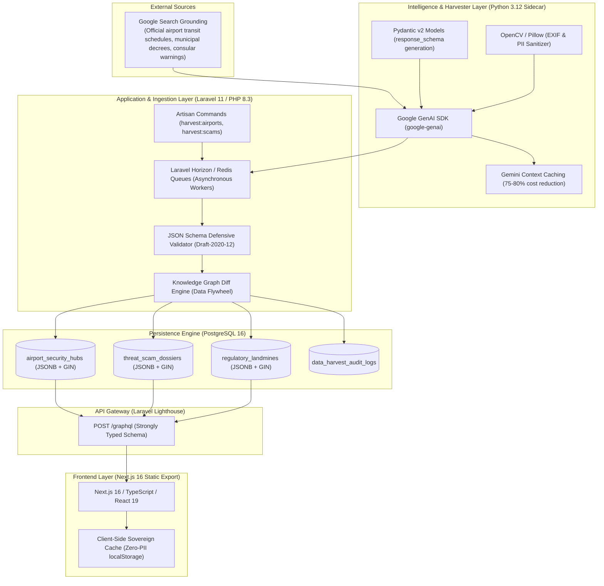

# Google Gemini API Grounding: Strategic Benefits & Backend Tech Stack Architecture

## 1. Executive Summary

This document specifies the server-side architecture for leveraging the **Google Gemini API with Google Search Grounding** within the [SoloTravelSecurity.com](https://solotravelsecurity.com) platform.

Unlike typical client-side AI implementations that expose API keys, suffer high latency (2–6s), and risk PII leaks, our system operates strictly on the **Laravel and Python backend**. Gemini is utilized as an **asynchronous intelligent data layer** that harvests, validates, and indexes atomic travel security "LEGO blocks" into a relational PostgreSQL database with `JSONB` GIN indexing, served to the Next.js 16 frontend via **Laravel Lighthouse GraphQL**.



---

## 2. Blue Ocean Strategy & Grounding Benefits

Traditional travel security platforms operate in a **Red Ocean**: they publish subjective, monolithic destination articles ("Top 10 Safety Tips for Rome"), rely on outdated 6-month consular advisories, collect invasive user PII (GPS, passport uploads), and utilize hallucination-prone chatbots.

By decoupling LLM generation from real-time client interaction and grounding Gemini on the backend, we capture an uncontested **Blue Ocean** via Value Innovation:

### The ERRC Value Innovation Matrix

| Eliminate                                                                                                                                                                                                                                                                                                                                                                                                                                                | Reduce                                                                                                                                                                                                                                                                                                                                                                                                                                     |
| :------------------------------------------------------------------------------------------------------------------------------------------------------------------------------------------------------------------------------------------------------------------------------------------------------------------------------------------------------------------------------------------------------------------------------------------------------- | :----------------------------------------------------------------------------------------------------------------------------------------------------------------------------------------------------------------------------------------------------------------------------------------------------------------------------------------------------------------------------------------------------------------------------------------- |
| • **Client-Side API Keys**: Zero exposure of Google API credentials in browser bundles.<br/>• **LLM Hallucinations**: Constrained decoding (`response_schema`) + Google Search Grounding.<br/>• **Editorial Stagnation**: Manual authoring bottlenecks replaced with automated background crawlers.<br/>• **User PII Capture**: No GPS, identity, or flight booking tracking required.                                                                   | • **User Latency**: Decreased from 3–6s (live LLM call) to **<30ms** (GraphQL / PostgreSQL JSONB query).<br/>• **Inference Costs**: Reduced by **75–80%** via Gemini Context Caching.<br/>• **Dispute & Extortion Anxiety**: Replaced with observable, falsifiable binary Truth Tables.<br/>• **Customs Seizure Risks**: Ambiguous foreign medication laws translated into deterministic permission matrices.                              |
| **Raise**                                                                                                                                                                                                                                                                                                                                                                                                                                                | **Create**                                                                                                                                                                                                                                                                                                                                                                                                                                 |
| • **Geospatial & Temporal Precision**: Exact airport terminal door numbers, express train shutdown hours (e.g. 23:23 FCO).<br/>• **Epistemic Verifiability**: Every safety protocol tied to official citations and observable falsification tests.<br/>• **Programmatic Scale**: 10,000+ atomic pSEO / SKAG landing pages compiled from modular LEGO blocks.<br/>• **Customer Trust**: Verifiable Zero-PII privacy guarantee with local-first execution. | • **Live Grounded Ingress Sentinel**: Real-time synthesized late-night transit briefings.<br/>• **Multimodal Sensory Shield**: Camera-based visual audits of taxi meters, decals, and medication packages.<br/>• **Self-Healing Knowledge Graph**: Background cron jobs detecting municipal fare and route shifts.<br/>• **B2B Duty-of-Care Data Feed**: Enterprise-grade structured risk API for corporate travel platforms and insurers. |

---

## 3. Technology Stack & Component Responsibilities

The system is structured across 5 decoupled layers:

### Layer 1: Intelligence & Harvester Layer (Python 3.12 Sidecar)

- **Runtime**: Python 3.12
- **Core Libraries**:
  - `google-genai` (Official Google GenAI SDK)
  - `pydantic` v2.6+ (Schema definition and native JSON Schema compilation)
  - `pillow` & `opencv-python-headless` (EXIF stripping and PII redacting for multimodal inputs)
  - `httpx` (Asynchronous HTTP client)
- **Role**:
  - Executes grounded searches using Google Search Grounding (`tools=[types.Tool(google_search=types.GoogleSearch())]`).
  - Constrains output tokens using Pydantic models passed directly into `response_schema`.
  - Manages Gemini **Context Caching** (`client.caches.create(...)`) for static travel corpora (500k+ tokens of legal and transit decrees).

### Layer 2: Application & Orchestration Layer (Laravel 11 / PHP 8.3)

- **Runtime**: PHP 8.3 CLI / FPM
- **Framework**: Laravel 11.x
- **Core Components**:
  - **Laravel Horizon**: Redis-backed queue manager orchestrating asynchronous harvest jobs (`App\Jobs\HarvestAirportIngressJob`, `App\Jobs\HarvestScamDossierJob`).
  - **Artisan CLI**: Scheduled commands (`php artisan schedule:run`) for recurring cron updates.
  - **JSON Schema Validator**: `opis/json-schema` or `justinrainbow/json-schema` validating raw Python payloads against Draft-2020-12 schemas before persistence.
  - **Zero-PII Privacy Filter**: Strips user identifiers, session IDs, and request headers before dispatching any ad-hoc requests to the Python sidecar.
  - **Diff & Patch Engine**: Compares incoming payloads against existing PostgreSQL rows to detect fare increases, timetable adjustments, or new scams.

### Layer 3: Storage & Indexing Engine (PostgreSQL 16)

- **Database**: PostgreSQL 16
- **Storage Pattern**: Hybrid Relational + `JSONB`
- **Key Tables**:
  - `airport_security_hubs`: Relational foreign keys (`iata`, `country_code`, `curfew_hour`) + `payload jsonb`.
  - `threat_scam_dossiers`: Indexed by `vector_category`, `severity` + `truth_table jsonb`.
  - `regulatory_landmines`: Indexed by `country_code`, `substance_slug` + `penalties jsonb`.
  - `data_harvest_audit_logs`: Append-only log of model runs, grounding query strings, citations, and detected diffs.
- **Indexing Strategy**:
  - B-Tree indexes on relational columns (`iata`, `slug`, `country_code`).
  - GIN indexes on JSONB fields:
    ```sql
    CREATE INDEX idx_airports_gin ON airport_security_hubs USING gin (payload jsonb_path_ops);
    CREATE INDEX idx_scams_truth_table_gin ON threat_scam_dossiers USING gin (truth_table jsonb_path_ops);
    ```

### Layer 4: API & Hydration Gateway (Laravel Lighthouse GraphQL)

- **Protocol**: GraphQL (POST `/graphql`)
- **Package**: `nuwave/lighthouse` v6.x
- **Role**:
  - Serves cached, schema-typed data to both the static site build process and client-side dynamic queries.
  - Exposes queries (`airportSecurityHub`, `evaluateIngressPlaybook`, `threatScamDossier`, `searchFacetedItems`).
  - Exposes mutations for Zero-PII client-side favorites synchronization (`saveFavorite`, `removeFavorite`).

### Layer 5: Presentation & Client Execution (Next.js 16)

- **Framework**: Next.js 16.3 (App Router, Turbopack)
- **Mode**: Static Site Generation (`output: "export"`) with isomorphic GraphQL client.
- **Type Safety**: `@graphql-codegen` auto-generates TypeScript types directly from Lighthouse `.graphql` schemas.
- **Privacy Model**: 100% Zero-PII local-first execution. Favorites, travel dates, and luggage profiles reside exclusively in browser `localStorage`.

---

## 4. End-to-End Execution Flow

### Asynchronous Harvesting Flow (Background Cron)

1. **Trigger**: Laravel Scheduler triggers `php artisan harvest:airports --all` daily at 02:00 UTC.
2. **Dispatch**: Laravel dispatches 50 `HarvestAirportIngressJob` tasks to Redis via Laravel Horizon.
3. **Execution**: Python sidecar executes `harvest_airport(iata)` using `google-genai`:
   - Google Search Grounding queries official transit feeds and airport authority pages.
   - Gemini token sampler constrains generation to `AirportSecurityHub` Pydantic schema.
4. **Validation**: Python emits JSON $\to$ Laravel job validates payload against `schemas/airport-ingress-hub.schema.json`.
5. **Diff Analysis**: Laravel checks if `lateNightCurfew` or `officialTaxi.flatRate` has changed:
   - If changed: Upserts PostgreSQL record, writes to `data_harvest_audit_logs`, and triggers a deploy webhook to rebuild static pSEO pages.
   - If unchanged: Updates `last_verified_at` timestamp.

### User Request Flow (Runtime Ingress Query)

1. **User Action**: Traveler lands on `/playbook/airports/fco` or selects arrival time 23:45 on the portal.
2. **Delivery**: Next.js serves the pre-rendered static page from Cloudflare edge cache in **<20ms**.
3. **Dynamic Evaluation**: Client-side algebraic combiner (`src/lib/engine/lego-combiner.ts`) evaluates the arrival hour (23:45) against the pre-loaded airport block (Leonardo Express cutoff: 23:23):
   - Ingress Vulnerability Score calculated locally: `95/100 (Critical)`.
   - Displays official taxi staging: `Terminal 3 Door 4, €50 flat rate`.
   - Activates hallway scam truth table: `3 falsification tests loaded`.
4. **Result**: **Zero network latency, zero API token cost, zero PII transmitted.**

---

## 5. Security & Privacy Architecture

```
User Device (Browser)
   │ [Anonymous Query / Scrubbed Photo]
   ▼
[TLS 1.3 / Cloudflare WAF]
   │
   ▼
Laravel API Gateway (Reverse Proxy / Sanitizer)
   │ 1. Strips IP, cookies, user agents
   │ 2. Strips image EXIF metadata (GPS, device ID)
   │ 3. Blurs faces & payment cards (OpenCV)
   │
   ├───> PostgreSQL 16 (Pre-harvested data lookup)
   │
   └───> Python Gemini Sidecar (Only for grounded harvest or anonymous multimodal audit)
            │
            └───> Google Gemini API (Isolated token context, zero user linkage)
```

1. **API Key Isolation**: The Gemini API key resides solely in the server `.env` accessed by Python. It is never compiled into JavaScript bundles.
2. **Zero-PII Sovereign Matching**: The platform does not require or accept user accounts, email addresses, or phone numbers. All personalization runs client-side using transient state.
3. **Multimodal Sanitization Airlock**: When a user submits an image (e.g., taxi meter or pharmacy packaging) for visual analysis:
   - Laravel strips all EXIF metadata (GPS location, camera serial number, timestamps).
   - Python sidecar runs an OpenCV Haar-cascade / blur filter over detected faces and credit card numbers before the image buffer is dispatched to the Gemini Vision endpoint.
4. **Context Caching Isolation**: Gemini Context Caches only contain public municipal statutes and transit schedules. No user-generated content or personal sessions are ever written to the shared cache.
