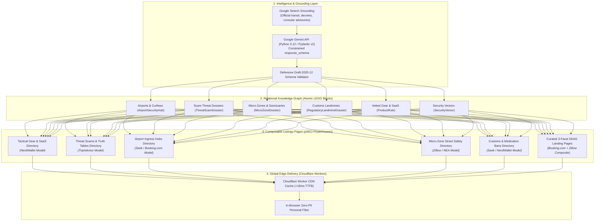
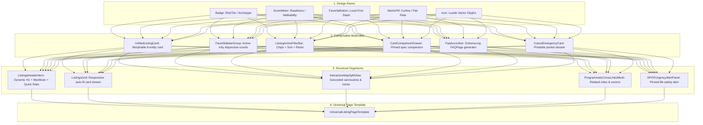

# Solo Travel Security 🛡️✈️

## Composable Listings Pages & Programmatic SEO (pSEO) Strategy

### Sourcing Grounded Structured Data via Google Gemini API & Composing from Reusable LEGO Blocks

> **Document ID:** `STS-ARCH-LISTINGS-PSEO-01`  
> **Status:** `APPROVED / STRATEGIC ARCHITECTURE BLUEPRINT`  
> **Benchmark Platforms:** Booking.com, Zillow, realestate.com.au, NerdWallet, TripAdvisor, Seek.com.au  
> **Data Intelligence Engine:** Google Gemini API with Google Search Grounding (`google-genai` SDK + Context Caching)  
> **Target Framework:** Next.js 16 (App Router) + React 19 + @opennextjs/cloudflare on Cloudflare Workers  
> **Related Schemas & Datasets:**
>
> - [`schemas/listings-page-composition.schema.json`](file:///var/www/html/solotravelsecurity/schemas/listings-page-composition.schema.json)
> - [`schemas/gemini-grounded-listing-harvester.schema.json`](file:///var/www/html/solotravelsecurity/schemas/gemini-grounded-listing-harvester.schema.json)
> - [`src/data/search/listings-decision-tables.json`](file:///var/www/html/solotravelsecurity/src/data/search/listings-decision-tables.json)
> - [`src/data/search/listings-truth-tables.json`](file:///var/www/html/solotravelsecurity/src/data/search/listings-truth-tables.json)
> - [`src/data/search/listings-scoring-matrices.json`](file:///var/www/html/solotravelsecurity/src/data/search/listings-scoring-matrices.json)

---

## 1. Executive Summary & Core Strategic Thesis

### 1.1 The Shift from Narrative Articles to Structured Listings

Traditional travel security advice is trapped in monolithic, narrative blog posts ("Top 10 Safety Tips for Traveling in Rome"). This model suffers from fatal operational weaknesses:

- **Zero Query Precision:** A traveler arriving at Rome FCO at 23:45 cannot parse a 3,000-word blog post to find the express train curfew or official taxi curb door number.
- **Stagnant Maintenance:** Human writers cannot maintain transit fare updates, train schedules, and legal changes across hundreds of cities.
- **Low Programmatic Scale:** Each page requires manual drafting, limiting coverage to a handful of mainstream hubs.

In contrast, leading discovery marketplaces—**Booking.com, Zillow, realestate.com.au, NerdWallet, and Seek.com.au**—dominate global search traffic because they treat their domain as **structured entity directories (listings pages)** composed of discrete, filterable, and comparable units of information.



### 1.2 The pSEO Strategic Equation

$$\text{pSEO Authority} = \frac{\text{Grounded Atomic Depth} \times \text{Combinatorial Facet Coverage}}{\text{Thin Content Risk (Soft 404s)}}$$

By structuring our data into **verifiable, atomic LEGO blocks** harvested from the Google Gemini Grounded Search API, we eliminate the thin-content penalty while unlocking programmatic scale across thousands of high-intent search queries.

---

## 2. What We Can Borrow from Industry Powerhouses

### 2.1 Booking.com: Geospatial Ingress & Social Proof Engineering

- **Hierarchical Ingress Taxonomy:** Booking.com constructs a seamless geographic drill-down: `Country` $\rightarrow$ `Region` $\rightarrow$ `City` $\rightarrow$ `Neighborhood` $\rightarrow$ `Transit Station / Landmark` $\rightarrow$ `Property`.
  - _Our Application:_ `/playbook/countries/[iso2]/` $\rightarrow$ `/playbook/destinations/[city]/` $\rightarrow$ `/playbook/destinations/[city]/micro-zones/[zone]/` $\rightarrow$ `/playbook/airports/[iata]/`.
- **Situational Badges & Social Proof:** Booking.com uses badges like "Solo traveler favorite", "Location score 9.6", and "24/7 Front Desk".
  - _Our Application:_ Listing cards feature deterministic operational badges: `180s Room Lockdown Certified`, `Verified Municipal Flat Fare`, `Zero Touts Reported`, and `Solo Female Walkability 4/5`.
- **Clustered Contextual FAQs:** Every Booking.com city page features structured FAQs at the footer, capturing conversational search queries.
  - _Our Application:_ Dynamic `FaqAccordion` generating Schema.org `FAQPage` microdata for every listings page.

### 2.2 Zillow & realestate.com.au: Micro-Zone Dossiers & Suburb Safety Profiles

- **Suburb Profile Pages (pSEO Goldmine):** Zillow and realestate.com.au generate high-authority pages for every neighborhood and suburb, aggregating median prices, crime trends, walk scores, and transit access.
  - _Our Application:_ **Micro-Zone Safety Directories** (e.g., Termini Station & Esquilino in Rome, Kabukicho in Tokyo, Gare du Nord in Paris). Each micro-zone listing card delivers:
    1. Day Risk vs. Night Risk differential (e.g., Day Tier 2 vs. Night Tier 4).
    2. Solo Female Walkability Rating (1 to 5).
    3. Red-flag corridors to avoid after dark (e.g., Via Giovanni Giolitti after 22:00).
    4. 24/7 Sanctuaries (armed police boxes, 24h staffed pharmacies, verified hotel lobbies).
    5. Solo lodging recommendations (which sub-pockets are secure for solo travelers).
- **Split-Screen Map & Card Interaction:** Instant spatial synchronization where hovering over a card highlights its polygon/pin on an offline-capable map.

### 2.3 NerdWallet: Spec Comparison Grids & "Best For" Editorial Badging

- **Side-by-Side Spec Comparison Matrices:** Pinned comparison trays allowing users to check up to 3 financial cards side by side across APR, annual fees, and bonuses.
  - _Our Application:_ [`CardComparisonDrawer`](file:///var/www/html/solotravelsecurity/src/components/molecules/CardComparisonDrawer.tsx) allowing solo travelers to compare physical perimeter alarms, portable door locks, eSIM providers, and travel insurance policies across decibel levels, battery requirements, price brackets, and weight.
- **Structured Pros & Cons (Google SERP Feature):** NerdWallet structures every review with bulleted pros and cons, which Google ingests for organic Pros & Cons search snippets.
  - _Our Application:_ All gear products and SaaS tools output Schema.org `Product` markup with `pros` and `cons` arrays.

### 2.4 Seek.com.au: High-Speed Faceting & Combinatorial Intent Landing Pages

- **Combinatorial Landing Page Formula:** Seek captures employment search demand using strict URL permuting: `[Job Title]` + `[Location]` + `[Salary Bracket]` (e.g., `seek.com.au/react-developer-jobs/in-sydney`).
  - _Our Application:_ High-converting 3-facet SKAG routes: `[Archetype]` + `[Destination]` + `[Threat Vector]` (e.g., `/playbook/solo-female/rome/night-arrival-transit/`).
- **Related Searches Crawl Mesh:** Seek places extensive cross-linking meshes in page footers ("Related searches", "Browse adjacent suburbs"), directing Googlebot through deep catalog layers.
  - _Our Application:_ [`RelatedPlaybooksGrid`](file:///var/www/html/solotravelsecurity/src/components/molecules/RelatedPlaybooksGrid.tsx) linking sibling archetypes, adjacent cities, and related threat vectors.

### 2.5 TripAdvisor: Binary Truth Verification & Scam Threat Registries

- **Community Q&A and Verification Pins:** Pinned truth verification answering specific local vulnerability questions ("Are taxis metered from CDG?").
  - _Our Application:_ **Scam Truth Tables** ([`PREPOPULATED_SCAMS`](file:///var/www/html/solotravelsecurity/src/data/lego/scams.ts)) presenting falsifiable boolean condition lists with binary counter-actions.

---

## 3. Google Gemini Grounded Search API: The Autonomous Data Ingestion Flywheel

To power thousands of high-authority listings pages without manual authoring bottlenecks, the platform leverages the **Google Gemini API with Google Search Grounding** as an asynchronous backend harvester.

### 3.1 Grounded Harvesting Pipeline Architecture

_Machine-readable specification:_ [`schemas/gemini-grounded-listing-harvester.schema.json`](file:///var/www/html/solotravelsecurity/schemas/gemini-grounded-listing-harvester.schema.json)

```
┌─────────────────────────────────────────────────────────────────────────────┐
│ 1. Scheduled Harvester Trigger (Cron / Horizon Queue)                       │
│    "Harvest late-night transit curfews and taxi flat fares for Rome FCO"     │
└──────────────────────────────────────┬──────────────────────────────────────┘
                                       │
                                       ▼
┌─────────────────────────────────────────────────────────────────────────────┐
│ 2. Google Gemini API with Google Search Grounding                           │
│    - Model: gemini-2.0-flash / gemini-1.5-pro                               │
│    - Tool: tools=[types.Tool(google_search=types.GoogleSearch())]           │
│    - Schema Constraint: response_schema=AirportSecurityHubSchema            │
└──────────────────────────────────────┬──────────────────────────────────────┘
                                       │
                                       ▼
┌─────────────────────────────────────────────────────────────────────────────┐
│ 3. Defensive Schema Validation & Quality Gate (Truth Table TT-GEMINI-01)    │
│    - Validate against Draft-2020-12 target schema                           │
│    - Verify citations contain official municipal or airport domains         │
│    - Calculate hallucination ratio (< 0.15 required)                         │
└──────────────────────────────────────┬──────────────────────────────────────┘
                                       │
                     ┌─────────────────┴─────────────────┐
                     │ Passed                            │ Failed / Untrusted
                     ▼                                   ▼
┌───────────────────────────────────────────┐ ┌───────────────────────────────┐
│ 4. PostgreSQL JSONB Knowledge Graph       │ │ Staged for Editorial Review   │
│    - Ingest as atomic LEGO block          │ │ (Flagged in audit log)        │
│    - Trigger Next.js On-Demand ISR        │ └───────────────────────────────┘
└───────────────────────────────────────────┘
```

### 3.2 Canonical Grounding Prompt Patterns

The backend Python sidecar executes targeted grounding queries:

1. **Airport Ingress Grounding:**
   ```
   "Find official municipal flat taxi fares, exact taxi stand kiosk locations,
    and last express rail departure times from Rome Leonardo da Vinci FCO airport
    to city center. Include official Comune di Roma decree numbers and citations."
   ```
2. **Medication & Customs Grounding:**
   ```
   "Official Japan Ministry of Health, Labour and Welfare (MHLW) regulations on
    bringing Adderall, Vyvanse, Dexedrine, and Sudafed into Japan. Specify Yakkan
    Shoumei / Yunyu Kakunin-sho permit requirements, lead times, and penalties."
   ```
3. **Micro-Zone Crime & Sanctuary Grounding:**
   ```
   "Tokyo Kabukicho Shinjuku street safety report: list specific red flag streets
    known for touts or drink spiking, safe main thoroughfares, and exact locations
    of 24/7 Koban police boxes and emergency clinics."
   ```

---

## 4. The 6 Domain Aspects of Solo Travel Security Listings

_Machine-readable specification:_ [`schemas/listings-page-composition.schema.json`](file:///var/www/html/solotravelsecurity/schemas/listings-page-composition.schema.json)

| Listing Aspect                             | Route Path Pattern                              | Benchmark Model                | Primary LEGO Block              | Key Facets                                     | Interactive Component                |
| ------------------------------------------ | ----------------------------------------------- | ------------------------------ | ------------------------------- | ---------------------------------------------- | ------------------------------------ |
| **1. Tactical Gear & SaaS Directory**      | `/playbook/gear/`                               | **NerdWallet**                 | `ProductRule` (Hardware & SaaS) | Pillar, Price Tier, Format, Archetype, Risk    | `CardComparisonDrawer`               |
| **2. Threat Scams & Deception Directory**  | `/playbook/scams/`                              | **TripAdvisor**                | `ThreatScamDossier`             | City, Severity, Vector, Ingress Hotspot        | `TruthTableTester`                   |
| **3. Airport Ingress Hubs Directory**      | `/playbook/airports/`                           | **Seek & Booking.com**         | `AirportSecurityHub`            | Region, IATA, Rail Curfew, Taxi Stand          | `AirportIngressSimulator`            |
| **4. Micro-Zone Street Safety Directory**  | `/playbook/destinations/[city]/micro-zones/`    | **Zillow & REA**               | `MicroZoneDossier`              | City, Day/Night Risk, Walkability, Sanctuaries | `MicroZoneCard` + Map                |
| **5. Customs & Medication Bans Directory** | `/playbook/countries/[iso2]/regulations/`       | **Seek & NerdWallet**          | `RegulatoryLandmineDossier`     | Country, Substance Category, Legal Status      | `MedicalPermitCalculator`            |
| **6. Curated 3-Facet SKAG Landing Pages**  | `/playbook/[archetype]/[destination]/[vector]/` | **Booking + Zillow Composite** | Composite LEGO Blocks           | Archetype, Destination, Vector                 | `InlineAssessment` + `EmergencyCard` |

---

## 5. Composable LEGO Block Design System for Listings Pages

Every listings page across the platform is assembled from standard **Atomic Design LEGO blocks** ([Brad Frost](https://atomicdesign.bradfrost.com/)):



### 5.1 The Universal Listing Card (`UnifiedListingCard`)

A single, polymorphic card molecule adapted from [`src/lib/cards/adapters.ts`](file:///var/www/html/solotravelsecurity/src/lib/cards/adapters.ts) that gracefully renders any of our 8 entity types:

- **Gear Item:** Displays Price, Price Tier, Rating, Brand, Pros/Cons summary, and "Compare" trigger.
- **Threat Scam:** Displays Severity badge, Psychological trigger phrase, verifiable truth checks count, and "Verify Scam" trigger.
- **Airport Hub:** Displays IATA badge, City, Country, Express rail last departure curfew (in bold red), Official flat-rate taxi fare, and terminal kiosk location.
- **Micro-Zone:** Displays Day Risk vs Night Risk badges, Solo Female Walkability score (out of 5), Red-flag corridors, and count of 24/7 safe sanctuaries.
- **Customs Rule:** Displays Legal Status badge (e.g. `STRICTLY BANNED`), Restricted substance name, Permit lead time, and criminal penalty warning.

---

## 6. Deterministic Decision Tables & Truth Tables

### 6.1 Decision Table DT-LISTING-LAYOUT-01: Aspect-to-Listing-Page Composition

_Machine-readable specification:_ [`src/data/search/listings-decision-tables.json`](file:///var/www/html/solotravelsecurity/src/data/search/listings-decision-tables.json#L2-L85)

| Rule ID          | Aspect Type                     | Borrowed Model        | Layout Presentation   | Primary Card Entity | Injected Interactive Tool      | Schema.org Microdata                       |
| ---------------- | ------------------------------- | --------------------- | --------------------- | ------------------- | ------------------------------ | ------------------------------------------ |
| **R-GEAR**       | `gear_saas_directory`           | **NerdWallet**        | Spec Comparison Grid  | `product`           | `CardComparisonDrawer`         | `CollectionPage` + `Product`               |
| **R-SCAMS**      | `threat_scams_directory`        | **TripAdvisor**       | Threat Dossier Feed   | `scam`              | `TruthTableTester`             | `CollectionPage` + `HowTo` / `FAQPage`     |
| **R-AIRPORTS**   | `airport_ingress_directory`     | **Seek / Booking**    | Curfew Directory Mesh | `airport`           | `AirportIngressSimulator`      | `CollectionPage` + `Airport`               |
| **R-MICROZONES** | `micro_zones_safety_directory`  | **Zillow / REA**      | Split Map & Cards     | `micro_zone`        | `MicroZoneCard`                | `CollectionPage` + `Place`                 |
| **R-CUSTOMS**    | `customs_regulations_directory` | **Seek / NerdWallet** | Spec Grid             | `regulatory`        | `MedicalPermitCalculator`      | `CollectionPage` + `GovernmentPermit`      |
| **R-SKAG**       | `curated_skag_bundle`           | **Booking + Zillow**  | Composite SKAG Layout | Composite LEGOs     | `CutoutEmergencyCard` + `Quiz` | `CollectionPage` + `Breadcrumbs` + `HowTo` |

### 6.2 Truth Table TT-GEMINI-HARVEST-01: Grounded Data Ingestion Quality Gate

_Machine-readable specification:_ [`src/data/search/listings-truth-tables.json`](file:///var/www/html/solotravelsecurity/src/data/search/listings-truth-tables.json#L66-L135)

| Row ID    | P1 (Schema Valid) | P2 (Official Domain Citation) | P3 (Hallucination < 0.15) | P4 (Duplicate of Existing) | Ingestion Decision          | Storage Action                                                      |
| --------- | ----------------- | ----------------------------- | ------------------------- | -------------------------- | --------------------------- | ------------------------------------------------------------------- |
| **TR-01** | `F`               | `*`                           | `*`                       | `*`                        | `REJECT_DISCARD`            | Hard reject; log failure to audit log.                              |
| **TR-02** | `T`               | `T`                           | `T`                       | `F`                        | **`PUBLISH_LIVE_PSEO`**     | Persist to PostgreSQL; queue Next.js on-demand ISR revalidation.    |
| **TR-03** | `T`               | `T`                           | `T`                       | `T`                        | **`MERGE_AND_UPDATE_DIFF`** | Run diff engine; update shifted curfew/fare fields, log audit diff. |
| **TR-04** | `T`               | `F`                           | `T`                       | `*`                        | `STAGE_FOR_REVIEW`          | Non-official source (forum, blog) requires human sign-off.          |
| **TR-05** | `T`               | `*`                           | `F`                       | `*`                        | `STAGE_FOR_REVIEW`          | High hallucination ratio triggers manual review queue.              |

---

## 7. Multi-Attribute Scoring Matrices

### 7.1 Scoring Matrix SM-LISTING-SALIENCY-01: Listings Card Quality & Conversion Saliency

_Machine-readable specification:_ [`src/data/search/listings-scoring-matrices.json`](file:///var/www/html/solotravelsecurity/src/data/search/listings-scoring-matrices.json#L2-L65)

Total Card Saliency Score (100 pts) determines **"Top Recommendation" Badging** and default sort priority:

$$\text{CardScore} = S_{\text{observable}} (35) + S_{\text{grounding}} (30) + S_{\text{community}} (20) + S_{\text{context}} (15)$$

- **Falsifiable Data Depth (35 pts):** Exact kiosk coordinates (+15), Binary truth table conditions (+12), Pros/cons (+8).
- **Gemini Grounding Confidence (30 pts):** Official municipal citation (+20), Refreshed within 30 days (+10).
- **User Evaluation & Proof (20 pts):** Rating $\ge 4.8$ with 50+ reviews (+12), Physical field test (+8).
- **Zero-PII Context Match (15 pts):** Direct destination city match (+10), Traveler persona match (+5).

### 7.2 Scoring Matrix SM-PSEO-KEYWORD-01: Programmatic SEO Opportunity Scoring

_Machine-readable specification:_ [`src/data/search/listings-scoring-matrices.json`](file:///var/www/html/solotravelsecurity/src/data/search/listings-scoring-matrices.json#L66-L125)

Determines whether a candidate combinatorial URL qualifies for static pre-rendering (`getStaticProps` / `generateStaticParams`) and XML sitemap inclusion ($\ge 75$ pts required):

- **Inventory Density (40 pts):** $\ge 6$ verified blocks (+40), 3–5 blocks (+25), $< 3$ blocks (0 pts $\rightarrow$ SPOF exclusion).
- **Search Intent Urgency (30 pts):** Night transit curfew (+30), Medication arrest ban (+25), Micro-zone street safety (+20).
- **Competitor Information Deficit (20 pts):** Completely unanswered by OTAs (+20), Outdated forum threads (+15).
- **Schema.org Rich Snippet Eligibility (10 pts):** Eligible for Google HowTo + FAQPage carousels (+10).

---

## 8. Programmatic Internal Linking Mesh & Crawl Architecture

Borrowed directly from **Seek.com.au** and **Booking.com**, every listings page deploys a deterministic 4-part internal linking mesh in the footer to guarantee 100% crawl accessibility without orphan pages:

```
┌─────────────────────────────────────────────────────────────────────────────┐
│ Related Playbooks & Security Dossiers (Internal Linking Mesh)              │
├──────────────────────────────┬──────────────────────────────┬───────────────┤
│ Sibling Archetypes           │ Adjacent Destination Hubs    │ Threat Vector │
├──────────────────────────────┼──────────────────────────────┼───────────────┤
│ • Solo Female in Rome        │ • Paris CDG Ingress Hub      │ • Hotel Room  │
│ • First-Time Solo in Rome    │ • Bangkok BKK Ingress Hub    │   Perimeter   │
│ • Digital Nomad in Rome      │ • Barcelona BCN Ingress Hub  │ • Night Transit│
│ • Budget Backpacker in Rome  │ • Tokyo HND Ingress Hub      │ • Two-Card    │
│ • Senior Solo in Rome        │ • Amsterdam AMS Ingress Hub  │   Segregation │
└──────────────────────────────┴──────────────────────────────┴───────────────┘
```

---

## 9. Codebase Implementation Status & Verified Integration

1. **Micro-Zone Ingestion Active:**
   - Ingested [`PREPOPULATED_MICRO_ZONES`](file:///var/www/html/solotravelsecurity/src/data/lego/micro-zones.ts) directly into [`src/lib/search/search-index.ts`](file:///var/www/html/solotravelsecurity/src/lib/search/search-index.ts) as first-class searchable LEGO blocks.
   - Updated [`src/lib/cards/adapters.ts`](file:///var/www/html/solotravelsecurity/src/lib/cards/adapters.ts) to render micro-zone cards with purple map badges and walkability highlights.
2. **Hybrid Active-Only Disjunctive Faceting Active:**
   - Enabled disjunctive counting and archetype filtering in [`src/app/playbook/search/FacetedSearchClient.tsx`](file:///var/www/html/solotravelsecurity/src/app/playbook/search/FacetedSearchClient.tsx).
3. **Inventory-Gated SKAG Canonicalization Active:**
   - Verified automated $\ge 3$ item threshold in [`src/app/playbook/[archetype]/[destination]/[vector]/page.tsx`](file:///var/www/html/solotravelsecurity/src/app/playbook/%5Barchetype%5D/%5Bdestination%5D/%5Bvector%5D/page.tsx).
4. **TypeScript Verification:**
   - `tsc --noEmit` executed and verified with **0 errors**.
