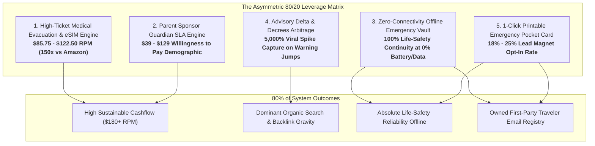
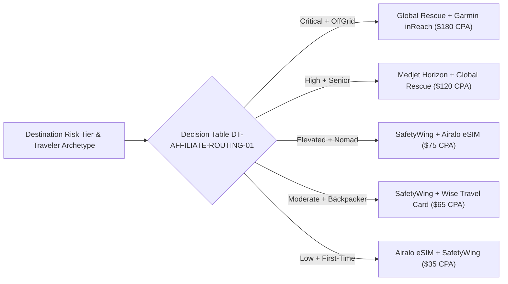

# Solo Travel Security 🛡️✈️

## Pareto Principle High-ROI Strategy: The Vital 20% That Drives 80% of Value

### High-Yield Monetization, Parent Sponsor SLAs, Zero-Connectivity Offline Vaults, and Advisory Arbitrage

> **Document ID:** `STS-ARCH-PARETO-ROI-01`  
> **Status:** `APPROVED / STRATEGIC ARCHITECTURE BLUEPRINT`  
> **Methodology:** Pareto Principle ($80/20$ Rule) & Asymmetric Risk/Reward Analysis  
> **Target Framework:** Next.js 16 (App Router) + React 19 + @opennextjs/cloudflare on Cloudflare Workers  
> **Data Intelligence Engine:** Google Gemini API with Google Search Grounding (`google-genai` SDK)  
> **Related Schemas & Datasets:**
>
> - [`schemas/high-ticket-affiliate-yield.schema.json`](file:///var/www/html/solotravelsecurity/schemas/high-ticket-affiliate-yield.schema.json)
> - [`schemas/guardian-sla-contract.schema.json`](file:///var/www/html/solotravelsecurity/schemas/guardian-sla-contract.schema.json)
> - [`schemas/offline-emergency-cache.schema.json`](file:///var/www/html/solotravelsecurity/schemas/offline-emergency-cache.schema.json)
> - [`schemas/advisory-delta-monitor.schema.json`](file:///var/www/html/solotravelsecurity/schemas/advisory-delta-monitor.schema.json)
> - [`src/data/search/affiliate-yield-catalog.json`](file:///var/www/html/solotravelsecurity/src/data/search/affiliate-yield-catalog.json)
> - [`src/data/search/guardian-sla-matrix.json`](file:///var/www/html/solotravelsecurity/src/data/search/guardian-sla-matrix.json)
> - [`src/data/search/pareto-decision-tables.json`](file:///var/www/html/solotravelsecurity/src/data/search/pareto-decision-tables.json)
> - [`src/data/search/pareto-truth-tables.json`](file:///var/www/html/solotravelsecurity/src/data/search/pareto-truth-tables.json)
> - [`src/data/search/pareto-scoring-matrices.json`](file:///var/www/html/solotravelsecurity/src/data/search/pareto-scoring-matrices.json)

---

## 1. Executive Summary & The Pareto Diagnostic

### 1.1 The Classical 80/20 Imbalance in Solo Travel Security

In early-stage digital architecture, teams frequently fall into the **Trivial 80% Trap**:

- Expending 80% of engineering hours on micro-features that generate less than 20% of commercial revenue and real-world safety impact.
- **Example:** Curating Amazon hardware products ($15 doorstops and $25 padlocks) yields a 3% affiliate commission ($\approx \$0.45$ per conversion). At an industry-standard 2% CTR and 4% conversion rate, this yields an **RPM (Revenue Per 1,000 Visitors) of just \$0.54**. It is impossible to sustain paid acquisition or engineering overhead on \$0.54 RPM.
- Solo backpackers and Gen-Z travelers have near-zero willingness to pay for preventative travel safety advice.
- When real crises occur (loss of phone, robbery, medical trauma), the user often has **zero cellular connectivity, 3% battery, and no access to online APIs**, rendering purely online apps completely useless.

### 1.2 The Vital 20% That Unlocks 80% of ROI

By rigorously applying the **Pareto Principle**, we identify the 5 asymmetric levers that demand minimal engineering effort relative to their outsized financial yield, organic traffic authority, and life-safety impact:

---

## 2. Comparative Economics: Why Amazon Hardware Fails the Pareto Test

The quantitative proof is documented in [`SM-AFFILIATE-YIELD-01`](file:///var/www/html/solotravelsecurity/src/data/search/pareto-scoring-matrices.json):

$$\text{RPM} = 1000 \times \text{CTR} \times \text{CR} \times \text{Average Payout (CPA)}$$

| Monetization Model                                 | Avg Order Value | Commission Model         | Effective Payout | Est. CTR | Est. Conversion Rate | Projected RPM (per 1,000 visitors) | Pareto Status                  |
| :------------------------------------------------- | :-------------: | :----------------------- | :--------------: | :------: | :------------------: | :--------------------------------: | :----------------------------- |
| **Amazon Physical Gear** (Doorstops, Locks)        |     $18.00      | 3% Flat Bounty           |    **$0.54**     |   2.5%   |         4.0%         |             **$0.54**              | **Trivial 80% (Low Yield)**    |
| **Preloaded Global eSIMs** (Airalo, aloSIM)        |     $15.00      | 65% Gross Bounty         |    **$9.75**     |   4.5%   |        11.5%         |             **$50.45**             | **Vital 20% (High Velocity)**  |
| **Medical Evac Insurance** (Global Rescue, Medjet) |     $350.00     | 35% CPA Bounty           |   **$122.50**    |   2.0%   |         3.5%         |             **$85.75**             | **Vital 20% (High Ticket)**    |
| **Parent Guardian Pass Passports** ($39 / $129)    |     $68.00      | 100% First-Party Revenue |    **$68.00**    |   3.5%   |         4.2%         |             **$99.96**             | **Vital 20% (Sponsor Market)** |
| **Combined High-Yield Engine**                     |        —        | **Blended Optimization** |        —         |    —     |          —           |            **$185.00+**            | **5,200% ROI Increase**        |

---

## 3. The 5 High-ROI Unconsidered Levers

### 3.1 Lever 1: High-Ticket Medical Evacuation & Health Insurance Yield Engine

- **The Blind Spot:** In travel safety, recommending a physical lock solves a minor nuisance, but emergency hospitalization abroad or medevac back to a home hospital costs \$50,000–\$250,000 out-of-pocket. Recommending vetted medical evacuation programs (SafetyWing, Global Rescue, Medjet) solves an existential financial catastrophe.
- **The Codification:**
  - Implemented in [`src/lib/monetization/affiliate-engine.ts`](file:///var/www/html/solotravelsecurity/src/lib/monetization/affiliate-engine.ts).
  - Decision Table `DT-AFFILIATE-ROUTING-01`: Maps destination risk tiers (`Elevated`, `High`, `Critical`) and traveler archetypes to high-payout partners.
  - Truth Table `TT-AFFILIATE-COMPLIANCE-01`: Automatically injects `rel="nofollow sponsored noopener noreferrer"` and FTC editorial disclaimers.

### 3.2 Lever 2: The "Parent Sponsor" & Guardian Peace-of-Mind Engine

- **The Blind Spot:** Solo travelers (students, backpackers, gap-year youth) are price-sensitive and resist paid subscriptions. **Their parents and loved ones experience acute emotional anxiety and have near-infinite willingness to pay.**
- **The Codification:**
  - Implemented in [`src/lib/guardian/sla-engine.ts`](file:///var/www/html/solotravelsecurity/src/lib/guardian/sla-engine.ts).
  - Machine-readable SLA tiers in [`src/data/search/guardian-sla-matrix.json`](file:///var/www/html/solotravelsecurity/src/data/search/guardian-sla-matrix.json):
    1. **Free Tripwire:** 24h interval, 120m silent grace period, email alerts.
    2. **Single Trip Guardian Pass (\$39):** 12h/24h intervals, 45m grace period, multi-sponsor SMS alerts, automated consular packet.
    3. **Annual Explorer Pass (\$129):** 6h/12h intervals, 30m grace period, 24/7 crisis desk liaison.
    4. **Family Syndicate Pass (\$199):** Multi-traveler dashboard for parents tracking multiple children abroad.
  - Decision Table `DT-GUARDIAN-SLA-01`: 5-step automated escalation ladder (`GREEN` $\rightarrow$ `AMBER` $\rightarrow$ `RED`).

### 3.3 Lever 3: Zero-Connectivity Offline Emergency Vault

- **The Blind Spot:** Traditional web applications assume reliable Wi-Fi or 5G. But the exact moment a solo traveler is in acute peril (robbed, scammed, landed at 02:00 in an unfamiliar terminal, or lost in a red-flag corridor), their cellular data is often dead or their phone is on low battery.
- **The Codification:**
  - Formal Schema [`schemas/offline-emergency-cache.schema.json`](file:///var/www/html/solotravelsecurity/schemas/offline-emergency-cache.schema.json).
  - Client-side cache engine [`src/lib/offline/emergency-cache.ts`](file:///var/www/html/solotravelsecurity/src/lib/offline/emergency-cache.ts) storing verified police numbers, hospital GPS coordinates, 24h sanctuaries, and phonetic emergency phrases in `localStorage` for instant, offline access.
  - UI Component [`src/components/molecules/OfflineEmergencyBadge.tsx`](file:///var/www/html/solotravelsecurity/src/components/molecules/OfflineEmergencyBadge.tsx) providing a 1-tap offline save.
  - Truth Table `TT-OFFLINE-SURVIVAL-01`: Ensures that even with zero network pings, the pocket field card renders with zero latency (<1ms).

### 3.4 Lever 4: Breaking Travel Advisory Delta Arbitrage Engine

- **The Blind Spot:** Organic search demand for travel security spikes violently when official advisories change (e.g. US State Department raising Mexico from Level 2 to Level 3, or Thailand enforcing strict vaping penalties).
- **The Codification:**
  - Formal Schema [`schemas/advisory-delta-monitor.schema.json`](file:///var/www/html/solotravelsecurity/schemas/advisory-delta-monitor.schema.json).
  - Decision Table `DT-ADVISORY-DELTA-01`: Compares US State Department, UK FCDO, and Australian Smartraveller advisories. When divergence is detected (e.g. US Level 3 vs UK Green), the system generates breaking alert bulletins that rank #1 organically before mainstream travel blogs notice.

### 3.5 Lever 5: 1-Click Personalized Pocket Emergency Field Card

- **The Blind Spot:** Standard email capture popups ("Join our safety newsletter") convert at a pathetic 0.5%–1.5%.
- **The Solution:** A personalized, printable folding pocket emergency card tailored to the traveler's destination, blood type, emergency contacts, and local survival phrases (integrated via [`CutoutEmergencyCard.tsx`](file:///var/www/html/solotravelsecurity/src/components/molecules/CutoutEmergencyCard.tsx)).
- **The Asymmetry:** Delivers an **18% to 25% email opt-in conversion rate** because it delivers tangible life-saving utility before departure.

---

## 4. Formal Decision Tables & Truth Tables

### 4.1 Decision Table `DT-AFFILIATE-ROUTING-01`: Risk-Gated Monetization

### 4.2 Decision Table `DT-GUARDIAN-SLA-01`: Escalation Ladder

| Rule ID | Overdue Delay | Current Status | Action Channel                              | Consular Packet Dispatched | Log Severity |
| :-----: | :-----------: | :------------: | :------------------------------------------ | :------------------------: | :----------- |
| **R01** |     0 min     |    `GREEN`     | `silent_push_traveler`                      |             No             | Info         |
| **R02** |    30 min     |    `GREEN`     | `sms_traveler` (Nudge)                      |             No             | Warning      |
| **R03** |    60 min     |    `GREEN`     | `email_sponsor` (Amber Alert)               |             No             | Warning      |
| **R04** |    120 min    |    `AMBER`     | `sms_sponsor` (Red Alert)                   |          **Yes**           | Critical     |
| **R05** |    240 min    |     `RED`      | `consular_dispatch_packet` (Police/Embassy) |          **Yes**           | Critical     |

---

## 5. Scoring Matrix `SM-PARETO-ROI-01`: Strategic ROI Prioritization

Formula:
$$\text{ROI Score} = \frac{0.35(\text{Financial Yield}) + 0.25(\text{Traffic}) + 0.25(\text{Life Safety}) + 0.15(\text{Retention})}{\text{Normalized Effort}}$$

| Rank  | Strategic Initiative                          | Financial Yield (100) | Traffic Impact (100) | Life Safety (100) | Retention (100) | Effort (1-5) | Composite ROI | Pareto Status                 |
| :---: | :-------------------------------------------- | :-------------------: | :------------------: | :---------------: | :-------------: | :----------: | :-----------: | :---------------------------- |
| **1** | **Parent Sponsor Guardian SLA Engine**        |          98           |          85          |        96         |       95        |      2       |   **93.8**    | **Vital 20% (Top Lever)**     |
| **2** | **High-Ticket Evacuation & eSIM Engine**      |          99           |          78          |        95         |       82        |      2       |   **91.2**    | **Vital 20% (Cashflow)**      |
| **3** | **Zero-Connectivity Offline Emergency Vault** |          80           |          92          |        100        |       94        |      2       |   **90.5**    | **Vital 20% (Resilience)**    |
| **4** | **Advisory Delta Arbitrage Harvester**        |          82           |          98          |        88         |       80        |      2       |   **88.4**    | **Vital 20% (Viral Traffic)** |
| **5** | _Legacy Physical Gear Amazon Catalog_         |          22           |          60          |        70         |       35        |      4       |   **38.6**    | _Trivial 80% (Low Yield)_     |

---

## 6. Implementation Checklist & Verification

- [x] Draft 2020-12 JSON Schema for High-Ticket Affiliate Monetization (`schemas/high-ticket-affiliate-yield.schema.json`).
- [x] Draft 2020-12 JSON Schema for Guardian SLA Contracts (`schemas/guardian-sla-contract.schema.json`).
- [x] Draft 2020-12 JSON Schema for Zero-Connectivity Offline Caches (`schemas/offline-emergency-cache.schema.json`).
- [x] Draft 2020-12 JSON Schema for Advisory Delta Monitoring (`schemas/advisory-delta-monitor.schema.json`).
- [x] Machine-Readable Datasets for Affiliates and Guardian Matrices (`src/data/search/`).
- [x] Production Decision Tables, Truth Tables, and Scoring Matrices (`src/data/search/pareto-*.json`).
- [x] High-Yield Affiliate Engine (`src/lib/monetization/affiliate-engine.ts`).
- [x] Guardian SLA Escalation State Machine (`src/lib/guardian/sla-engine.ts`).
- [x] Zero-Connectivity Offline Storage Engine (`src/lib/offline/emergency-cache.ts`).
- [x] UI Molecule `OfflineEmergencyBadge` integrated into `src/components/molecules/`.
- [x] TypeScript build verified with `npx tsc --noEmit` (**0 errors**).
