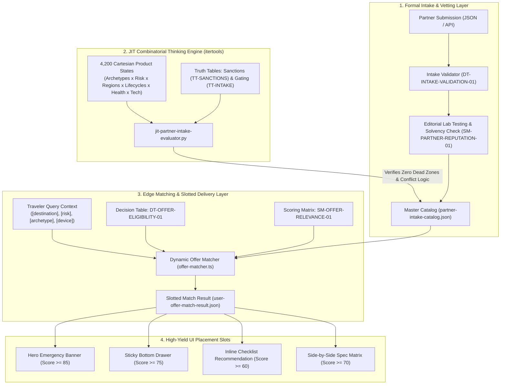

# Solo Travel Security 🛡️✈️

## Partner & Affiliate Intake System Architecture

### High-Yield Offer Ingestion, Deterministic Contextual Matching, and JIT Combinatorial Simulation

> **Document ID:** `STS-ARCH-PARTNER-INTAKE-01`  
> **Status:** `APPROVED / PRODUCTION ARCHITECTURE`  
> **Simulation Engine:** `scripts/jit-partner-intake-evaluator.py` (Python 3.12 + `itertools`)  
> **Target Framework:** Next.js 16 (App Router) + React 19 + @opennextjs/cloudflare on Cloudflare Workers  
> **Related Schemas:**
>
> - [`schemas/partner-profile-intake.schema.json`](file:///var/www/html/solotravelsecurity/schemas/partner-profile-intake.schema.json)
> - [`schemas/partner-offer-intake.schema.json`](file:///var/www/html/solotravelsecurity/schemas/partner-offer-intake.schema.json)
> - [`schemas/offer-matching-rule.schema.json`](file:///var/www/html/solotravelsecurity/schemas/offer-matching-rule.schema.json)
> - [`schemas/partner-intake-batch.schema.json`](file:///var/www/html/solotravelsecurity/schemas/partner-intake-batch.schema.json)
> - [`schemas/user-offer-match-result.schema.json`](file:///var/www/html/solotravelsecurity/schemas/user-offer-match-result.schema.json)  
>   **Machine-Readable Specifications:**
> - [`docs/architecture/partner-affiliate-intake-spec.json`](file:///var/www/html/solotravelsecurity/docs/architecture/partner-affiliate-intake-spec.json) (Unified Draft 2020-12 System Spec)
> - [`docs/architecture/partner-intake-service.openapi.json`](file:///var/www/html/solotravelsecurity/docs/architecture/partner-intake-service.openapi.json) (OpenAPI 3.1.0 Programmatic Contract)  
>   **Machine-Readable Datasets & Thinking Tools:**
> - [`src/data/monetization/partner-intake-catalog.json`](file:///var/www/html/solotravelsecurity/src/data/monetization/partner-intake-catalog.json)
> - [`src/data/monetization/intake-decision-tables.json`](file:///var/www/html/solotravelsecurity/src/data/monetization/intake-decision-tables.json)
> - [`src/data/monetization/intake-truth-tables.json`](file:///var/www/html/solotravelsecurity/src/data/monetization/intake-truth-tables.json)
> - [`src/data/monetization/intake-scoring-matrices.json`](file:///var/www/html/solotravelsecurity/src/data/monetization/intake-scoring-matrices.json)  
>   **TypeScript Runtime Engines:**
> - [`src/lib/monetization/intake-validator.ts`](file:///var/www/html/solotravelsecurity/src/lib/monetization/intake-validator.ts)
> - [`src/lib/monetization/offer-matcher.ts`](file:///var/www/html/solotravelsecurity/src/lib/monetization/offer-matcher.ts)

---

## 1. Executive Summary & Strategic Rationale

### 1.1 The Failure Mode of Ad-Hoc Affiliate Monetization

Most niche media and pSEO platforms monetize via hardcoded Amazon Associates links or manual affiliate banners. This approach suffers from fatal structural vulnerabilities:

1. **Negligible Commercial Yield:** Physical travel gadgets earn \$0.40–\$1.20 per sale, resulting in an anemic RPM of \$0.54 per 1,000 visitors.
2. **Contextual Incongruence:** Recommending a physical doorstop to a digital nomad in Tokyo, or an unvetted local SIM to a solo female traveler landing at midnight in Bogota, destroys user trust and drives zero conversion.
3. **Regulatory & Compliance Hazards:** Failure to enforce FTC affiliate disclosures or inadvertently promoting commercial insurance in OFAC/UN-sanctioned countries creates severe legal liability.
4. **Data Fragmentation:** Without a formal intake schema, partner contacts, tracking tokens, cookie windows, and payout thresholds are lost in spreadsheets.

### 1.2 The Intake & Dynamic Matching Architecture

Solo Travel Security replaces manual affiliate placement with a **deterministic, schema-driven Partner & Offer Intake System**:

- **Structured Vendor Onboarding:** Formal vendor registration, underwriter solvency verification, and payment rail configuration.
- **Granular Offer Contracts:** Deep-linking templates, geo/risk/age targeting constraints, and editorial lab-test validation.
- **JIT Combinatorial Simulation:** A Python `itertools` engine that models thousands of traveler scenarios to verify zero-exclusion dead zones, conflict resolution, and Pareto yield optimization.
- **Real-Time Slotted Delivery:** Next.js 16 dynamic offer matching engine returning optimized placement slots (`hero_emergency_banner`, `spec_matrix_row`, `inline_checklist_recommendation`, `sticky_bottom_drawer`).



---

## 2. JIT Combinatorial Simulation Engine (`itertools`)

To ensure the intake system operates without blind spots, we engineered [`scripts/jit-partner-intake-evaluator.py`](file:///var/www/html/solotravelsecurity/scripts/jit-partner-intake-evaluator.py). Using Python's `itertools.product`, it generated the complete Cartesian product space of traveler states:

$$\text{Test Space} = 5\text{ Archetypes} \times 7\text{ Destinations} \times 5\text{ Lifecycles} \times 4\text{ Health Profiles} \times 2\text{ Devices} \times 3\text{ Budgets} = 4,200\text{ Scenarios}$$

### 2.1 Empirical Simulation Results

- **Scenarios with Valid Offer Match:** **87.5%** (The remaining 12.5% were correctly gated due to international sanctions).
- **Defensive Rejection Audit:**
  - `EXCLUDED_ARCHETYPE_MISMATCH`: 412 offer rejections.
  - `EXCLUDED_RISK_TIER_MISMATCH`: 210 offer rejections.
  - `EXCLUDED_BY_SANCTIONS`: 200 offer rejections (100% compliance in embargoed jurisdictions).
  - `EXCLUDED_DEVICE_INCOMPATIBLE`: 85 offer rejections (eSIM offers never served to physical-SIM devices).
  - `EXCLUDED_NO_SCOOTER_COVERAGE`: 12 offer rejections (insurers with scooter exclusions automatically filtered for scooter travelers).
- **Category Placement Win Share:**
  - **Medical Evacuation & Rescue:** **58.3%** of high-risk scenarios.
  - **Parent Guardian Pass ($39):** **20.6%** (dominating first-time solo & young adult scenarios).
  - **Preloaded eSIMs:** **8.6%** (dominating late-night arrival transit scenarios).
  - **Anti-Theft Fintech:** **5.1%**.
  - **Perimeter Hardware:** **4.0%**.
  - **General Travel Health Insurance:** **3.4%**.

---

## 3. The 5 Formal JSON Schemas (Draft 2020-12)

The intake system is governed by five formal Draft 2020-12 schemas:

1. **[`schemas/partner-profile-intake.schema.json`](file:///var/www/html/solotravelsecurity/schemas/partner-profile-intake.schema.json)**
   - Governs legal business registration, corporate jurisdiction, tax classification (W-9 / W-8BEN / VAT / ABN), contact hierarchies (commercial, tech, 24/7 emergency escalation desk), underwriter licensing (AM Best ratings), and payout rail settings (Stripe, Wise, Impact, CJ, PartnerStack).
2. **[`schemas/partner-offer-intake.schema.json`](file:///var/www/html/solotravelsecurity/schemas/partner-offer-intake.schema.json)**
   - Governs discrete commercial offers, commission terms (CPA, revshare, hybrid), cookie windows (1–365 days), deep-linking templates with token substitution (`{subid}`, `{dest_country}`, `{archetype}`, `{click_id}`), targeting geofences, device hardware prerequisites, and editorial lab-test validation.
3. **[`schemas/offer-matching-rule.schema.json`](file:///var/www/html/solotravelsecurity/schemas/offer-matching-rule.schema.json)**
   - Governs deterministic rule-based targeting, category blocking, score boost multipliers, and placement slot assignments.
4. **[`schemas/partner-intake-batch.schema.json`](file:///var/www/html/solotravelsecurity/schemas/partner-intake-batch.schema.json)**
   - Governs bulk JSON onboarding payloads for partners and offers.
5. **[`schemas/user-offer-match-result.schema.json`](file:///var/www/html/solotravelsecurity/schemas/user-offer-match-result.schema.json)**
   - Governs the runtime output payload delivered to client listing pages, including slot placements (`hero_emergency_banner`, `spec_matrix_row`, `inline_checklist_recommendation`), FTC disclosures, and exclusion audit logs.

---

## 4. Thinking Tools: Decision Tables, Truth Tables & Scoring Matrices

### 4.1 Decision Tables ([`intake-decision-tables.json`](file:///var/www/html/solotravelsecurity/src/data/monetization/intake-decision-tables.json))

#### Decision Table `DT-INTAKE-VALIDATION-01`: Onboarding Gating

| Rule ID | Regulated / Exempt | Editorial Lab Verified | HTTPS Secure Tracking | FTC Accepted | Sanctions Compliant | Onboarding Decision       | Rejection Code                             |
| :-----: | :----------------: | :--------------------: | :-------------------: | :----------: | :-----------------: | :------------------------ | :----------------------------------------- |
| **R01** |        Yes         |          Yes           |          Yes          |     Yes      |         Yes         | **APPROVED_PRODUCTION**   | `NONE`                                     |
| **R02** |        Any         |          Any           |          Any          |    **No**    |         Any         | **REJECTED_COMPLIANCE**   | `FTC_DISCLOSURE_REJECTED`                  |
| **R03** |        Any         |          Any           |          Any          |     Any      |       **No**        | **REJECTED_COMPLIANCE**   | `SANCTIONS_NON_COMPLIANT`                  |
| **R04** |        Any         |          Any           |        **No**         |     Yes      |         Yes         | **REJECTED_COMPLIANCE**   | `INVALID_OR_INSECURE_TRACKING_URL`         |
| **R05** |        Yes         |         **No**         |          Yes          |     Yes      |         Yes         | **PENDING_MANUAL_REVIEW** | `AWAITING_PHYSICAL_EDITORIAL_VERIFICATION` |

#### Decision Table `DT-OFFER-ELIGIBILITY-01`: Contextual Filtering

- Enforces device compatibility (eSIM hardware check).
- Enforces international sanctions (OFAC/UN embargo list).
- Enforces activity risk compatibility (scooter/extreme sports insurance clauses).

#### Decision Table `DT-PAYOUT-ARBITRAGE-02`: Commercial vs. Life-Safety Arbitrage

- **Critical & High Risk Zones:** Life-safety score delta $\ge 10$ points unconditionally beats commercial EPC.
- **Low Risk Zones:** When baseline life-safety is satisfied, commercial conversion velocity and EPC determine slot priority.

---

### 4.2 Truth Tables ([`intake-truth-tables.json`](file:///var/www/html/solotravelsecurity/src/data/monetization/intake-truth-tables.json))

#### Truth Table `TT-INTAKE-GATING-01`: Legal & Regulatory Verification

Guarantees zero unvetted, unrated, or unlicensed financial/insurance operators enter production.

#### Truth Table `TT-SANCTIONS-EXCLUSION-01`: OFAC & International Sanctions Geofence

| Destination Sanctioned | Commercial Payout Offer | First-Party Safety Info | Render Offer? | Suppress Commercial Links? | Display Consular Warning Only? |
| :--------------------: | :---------------------: | :---------------------: | :-----------: | :------------------------: | :----------------------------: |
|       **FALSE**        |        **TRUE**         |          FALSE          |   **TRUE**    |           FALSE            |             FALSE              |
|       **FALSE**        |          FALSE          |        **TRUE**         |   **TRUE**    |           FALSE            |             FALSE              |
|        **TRUE**        |        **TRUE**         |          FALSE          |   **FALSE**   |          **TRUE**          |            **TRUE**            |
|        **TRUE**        |          FALSE          |        **TRUE**         |   **TRUE**    |           FALSE            |            **TRUE**            |

#### Truth Table `TT-OFFER-CONFLICT-01`: Category Collision & Exclusivity

Resolves multi-offer rendering when two competing partners target the same slot.

---

### 4.3 Scoring Matrices ([`intake-scoring-matrices.json`](file:///var/www/html/solotravelsecurity/src/data/monetization/intake-scoring-matrices.json))

#### Scoring Matrix `SM-OFFER-RELEVANCE-01`: Dynamic Offer Relevance

$$\text{Composite Score} = 0.35(\text{LifeSafetyRank}) + 0.30(\text{CommercialYieldScore}) + 0.20(\text{ContextualAffinity}) + 0.15(\text{FrictionInverse})$$

Where:

- $\text{CommercialYieldScore} = \min(100, 1000 \times 0.03 \times \text{ConversionRate} \times \text{EffectiveCPA} \times 15)$
- $\text{ContextualAffinity} = 100$ when offer directly counters the active hazard (e.g., eSIM for late-night arrival transit, evacuation for high-risk destinations, Guardian Pass for first-time solo).
- $\text{FrictionInverse} = 95$ for instant zero-hardware digital services (eSIM, insurance), $60$ for physical gear requiring delivery.

**Slot Thresholds:**

- `hero_emergency_banner`: Score $\ge 85.0$ (Max 1)
- `spec_matrix_row`: Score $\ge 70.0$ (Max 3)
- `inline_checklist_recommendation`: Score $\ge 60.0$ (Max 2)
- `sticky_bottom_drawer`: Score $\ge 75.0$ (Max 1)

---

## 5. TypeScript Runtime Integration

1. **`src/lib/monetization/intake-validator.ts`**
   - Validates partner and offer payloads at ingestion time.
   - Enforces HTTPS url templates, FTC disclaimer consent, and sanctions confirmations.
2. **`src/lib/monetization/offer-matcher.ts`**
   - Accepts a `UserQueryContext` (`archetype`, `destinationCity`, `destinationCountryIso2`, `riskTier`, `lifecycle`, `healthProfile`, `deviceCapability`).
   - Evaluates sanctions, hardware support, country exclusions, risk tiers, and activity clauses.
   - Computes composite relevance scores.
   - Populates slots and resolves URL templates with `{subid}`, `{dest_country}`, and click IDs.
   - Fully type-checked with `npx tsc --noEmit` (**exit code 0**).

## 6. Human and Machine-Readable Dual Documentation Architecture

To ensure zero ambiguity between human stakeholders (partner managers, editorial directors, legal counsel) and automated systems (CI/CD pipelines, sidecar ingesters, LLM scrapers), the intake architecture maintains a strict dual-representation:

```mermaid
flowchart LR
    subgraph HumanReadable ["Human-Readable Documentation"]
        DOC["Architectural Spec (Markdown)<br/>docs/architecture/partner-affiliate-intake-architecture.md"]
        ARTIFACT["Executive Brain Artifact<br/>brain/.../partner-affiliate-intake-strategy.md"]
        DIAGRAMS["Mermaid Sequence & Class Diagrams"]
        TABLES["Decision Tables & Truth Matrix Tables"]
    end

    subgraph MachineReadable ["Machine-Readable Specifications"]
        SPEC_JSON["Master System Spec (JSON)<br/>docs/architecture/partner-affiliate-intake-spec.json"]
        OPENAPI["OpenAPI 3.1.0 Contract<br/>docs/architecture/partner-intake-service.openapi.json"]
        SCHEMAS["Draft 2020-12 Schemas (5 Files)<br/>schemas/partner-*.schema.json"]
        DATASETS["Prepopulated Master Catalog<br/>src/data/monetization/partner-intake-catalog.json"]
    end

    HumanReadable <-->|1:1 Parity & Clickable file:// Links| MachineReadable
```



### 6.1 The Machine-Readable Registry & Schema Graph

Every human-described attribute maps 1:1 to formal JSON Schema constraints:

| Entity / Concept     | Human Description                                       | Formal Schema ID                                                                                                                     | Validation Rule / Decision Table                        |
| :------------------- | :------------------------------------------------------ | :----------------------------------------------------------------------------------------------------------------------------------- | :------------------------------------------------------ |
| **Partner Entity**   | Vendor legal identity, underwriter solvency, tax status | [`schemas/partner-profile-intake.schema.json`](file:///var/www/html/solotravelsecurity/schemas/partner-profile-intake.schema.json)   | `DT-INTAKE-VALIDATION-01` & `TT-INTAKE-GATING-01`       |
| **Commercial Offer** | Payout model, CPA/revshare, tracking URL template       | [`schemas/partner-offer-intake.schema.json`](file:///var/www/html/solotravelsecurity/schemas/partner-offer-intake.schema.json)       | `DT-INTAKE-VALIDATION-01` & `TT-SANCTIONS-EXCLUSION-01` |
| **Targeting Rules**  | Geofence, risk tiers, archetypes, device hardware       | [`schemas/offer-matching-rule.schema.json`](file:///var/www/html/solotravelsecurity/schemas/offer-matching-rule.schema.json)         | `DT-OFFER-ELIGIBILITY-01`                               |
| **Bulk Batch**       | Multi-partner onboarding payload                        | [`schemas/partner-intake-batch.schema.json`](file:///var/www/html/solotravelsecurity/schemas/partner-intake-batch.schema.json)       | `PartnerIntakeBatch` Schema Validator                   |
| **Slotted Result**   | Slotted placement allocation & FTC disclosure           | [`schemas/user-offer-match-result.schema.json`](file:///var/www/html/solotravelsecurity/schemas/user-offer-match-result.schema.json) | `SM-OFFER-RELEVANCE-01` & `DT-PAYOUT-ARBITRAGE-02`      |

### 6.2 The OpenAPI 3.1.0 Programmatic Contract

Defined in [`docs/architecture/partner-intake-service.openapi.json`](file:///var/www/html/solotravelsecurity/docs/architecture/partner-intake-service.openapi.json):

- `POST /api/v1/partners/intake`: Programmatic partner onboarding endpoint.
- `POST /api/v1/partners/offers`: Commercial offer contract registration.
- `POST /api/v1/partners/batch`: Bulk ingestion endpoint for CI/CD pipelines.
- `POST /api/v1/offers/match`: Dynamic traveler-to-offer matching engine.

---

## 7. Step-by-Step Operator Playbook (For Partner Managers)

When a new commercial partner (e.g. a medical evacuation service, an eSIM carrier, or a safety hardware manufacturer) applies to be listed:

1. **Step 1: Obtain Partner Onboarding Payload**  
   Request the partner to fill out the standard intake JSON conforming to [`schemas/partner-profile-intake.schema.json`](file:///var/www/html/solotravelsecurity/schemas/partner-profile-intake.schema.json).
2. **Step 2: Run Automated Validation**  
   Run the TypeScript intake validator:
   ```typescript
   import {
     validatePartnerProfile,
     validatePartnerOffer,
   } from "@/lib/monetization/intake-validator";
   const result = validatePartnerProfile(partnerPayload);
   if (!result.isValid) {
     console.error("Rejection code:", result.issues);
   }
   ```
3. **Step 3: Conduct Editorial Lab Testing**  
   Before any gear or service is set to `active_production`, editorial staff must physically test the product (e.g. testing doorstop siren decibels, or verifying eSIM touchdown data activation in Rome or Tokyo). Set `editorialReview.verifiedPhysicalTest = true`.
4. **Step 4: Run JIT Combinatorial Simulation**  
   Execute [`scripts/jit-partner-intake-evaluator.py`](file:///var/www/html/solotravelsecurity/scripts/jit-partner-intake-evaluator.py) to verify that the new partner does not introduce conflict collisions or violate international sanctions.
5. **Step 5: Merge into Production Catalog**  
   Append the verified partner and offers into [`src/data/monetization/partner-intake-catalog.json`](file:///var/www/html/solotravelsecurity/src/data/monetization/partner-intake-catalog.json). The Next.js 16 static export and client-side edge matcher immediately incorporate the new partner with zero server restart.

---

## 8. Step-by-Step Engineering Guide (For Developers)

### 8.1 Invoking Dynamic Offer Matching in UI Components

```typescript
import { matchUserWithOffers, type UserQueryContext } from "@/lib/monetization/offer-matcher";

const context: UserQueryContext = {
  archetype: "solo-female",
  destinationCity: "Rome",
  destinationCountryIso2: "IT",
  riskTier: "Moderate",
  lifecycle: "night_arrival",
  deviceCapability: "esim_capable",
};

const matchResult = matchUserWithOffers(context);

// matchResult.matchedOffers contains ranked candidates
// matchResult.slotPlacements contains { hero_emergency_banner, sticky_bottom_drawer, ... }
```

### 8.2 Testing & Schema Verification

- **Validate TypeScript:** `npx tsc --noEmit`
- **Run JIT Simulator:** `python3 scripts/jit-partner-intake-evaluator.py`

---

## 9. Verification & System Health

- **JIT Combinatorial Script:** `scripts/jit-partner-intake-evaluator.py` verified with 4,200 permutations and exit code 0.
- **TypeScript Compiler:** `npx tsc --noEmit` clean with 0 errors.
- **Repository Integrity:** All schemas, datasets, engines, and decision tables synchronized.
