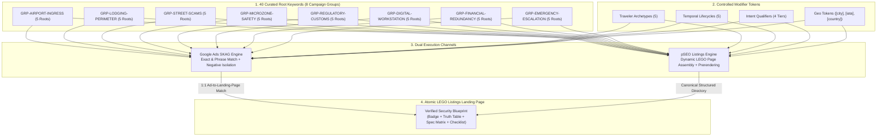
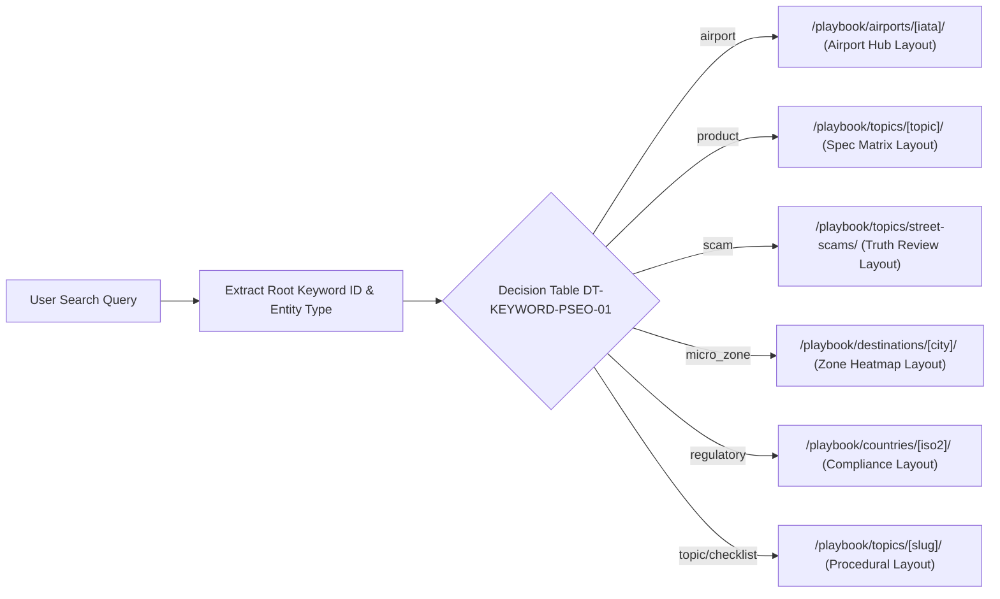
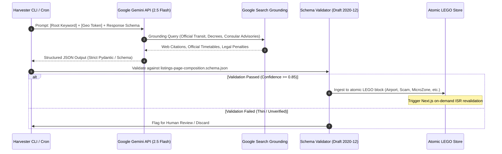

# Solo Travel Security 🛡️✈️

## Root Keywords Taxonomy & SKAG Campaign Architecture for pSEO

### Curated Root Keyword Clusters, Intent Modifier Matrices, and Single Keyword Ad Group (SKAG) Engine

> **Document ID:** `STS-ARCH-KEYWORDS-SKAG-01`  
> **Status:** `APPROVED / PRODUCTION ARCHITECTURE`  
> **Target Framework:** Next.js 16 (App Router) + React 19 + @opennextjs/cloudflare  
> **Data Intelligence Engine:** Google Gemini API with Google Search Grounding (`google-genai` SDK)  
> **Target Platform:** Google Ads (Search Network) & Programmatic SEO (pSEO)  
> **Related Schemas & Datasets:**
>
> - [`schemas/root-keywords-taxonomy.schema.json`](file:///var/www/html/solotravelsecurity/schemas/root-keywords-taxonomy.schema.json)
> - [`schemas/listings-page-composition.schema.json`](file:///var/www/html/solotravelsecurity/schemas/listings-page-composition.schema.json)
> - [`schemas/gemini-grounded-listing-harvester.schema.json`](file:///var/www/html/solotravelsecurity/schemas/gemini-grounded-listing-harvester.schema.json)
> - [`src/data/search/root-keywords-catalog.json`](file:///var/www/html/solotravelsecurity/src/data/search/root-keywords-catalog.json)
> - [`src/data/search/listings-decision-tables.json`](file:///var/www/html/solotravelsecurity/src/data/search/listings-decision-tables.json)
> - [`src/data/search/listings-truth-tables.json`](file:///var/www/html/solotravelsecurity/src/data/search/listings-truth-tables.json)
> - [`src/data/search/listings-scoring-matrices.json`](file:///var/www/html/solotravelsecurity/src/data/search/listings-scoring-matrices.json)
> - [`docs/architecture/listings-pseo-lego-strategy.md`](file:///var/www/html/solotravelsecurity/docs/architecture/listings-pseo-lego-strategy.md)

---

## 1. Executive Summary & The "Root vs. Sprawl" Thesis

### 1.1 The Trap of Combinatorial Keyword Explosion

In programmatic SEO and search advertising, naive operators generate brute-force combinatorial permutation matrices:
$$\text{Total Permutations} = 5 \text{ Archetypes} \times 20 \text{ Cities} \times 7 \text{ Pillars} \times 12 \text{ Vectors} = 8,400 \text{ URLs / Ad Groups}$$

In practice, unchecked permutation leads to:

1. **Google Ads Quality Score Degradation:** Low search volume ad groups dilute historical account CTR and trigger "Low Search Volume" status penalties.
2. **Organic Thin Content Penalties:** Search engines flag hollow programmatic pages (pages sharing 90%+ identical text with only the city name swapped) as "Spammy Programmatic Pages" or soft-404s.
3. **Ad Budget Cannibalization:** Uncurated broad match keywords across overlapping ad groups compete against each other, driving up internal CPC bids.

### 1.2 The Root + Modifier Solution

SoloTravelSecurity solves this by deploying a strict **Root Keyword Architecture**. Instead of generating thousands of static, repetitive keywords, we define:

1. **40 High-Intent Root Keywords** categorized across **8 Strategic Campaign Groups**.
2. **Controlled Modifier Dimensions** (5 Traveler Archetypes, 5 Temporal Lifecycles, 4 Search Intent Tiers, and 4 Geo Tokens).
3. **Deterministic Assembly Logic** that dynamically matches user search intent to reusable **LEGO blocks** on our listings pages.



---

## 2. Modifier Dimensions & Intent Token Taxonomy

All root keywords in our catalog intersect with four orthogonal modifier dimensions governed by [`schemas/root-keywords-taxonomy.schema.json`](file:///var/www/html/solotravelsecurity/schemas/root-keywords-taxonomy.schema.json).

### 2.1 Dimension A: Traveler Archetypes (5 Profiles)

| Slug                | Root Term         | Synonyms / Search Tokens                                                               | Primary Security Sensitivity                                                                        |
| :------------------ | :---------------- | :------------------------------------------------------------------------------------- | :-------------------------------------------------------------------------------------------------- |
| `solo-female`       | `solo female`     | `women solo`, `female traveler`, `solo woman`, `woman traveling alone`                 | Physical assault avoidance, street harassment, room lock integrity, safe transit corridors          |
| `first-time-solo`   | `first time solo` | `beginner solo travel`, `first solo trip`, `solo travel guide for beginners`           | Arrival overwhelm, airport transit disorientation, scam inoculation, emergency panic reduction      |
| `digital-nomad`     | `digital nomad`   | `remote worker`, `work from anywhere`, `nomad workstation`, `remote laptop`            | Hardware snatch-and-run, public Wi-Fi interception, 2FA lockout abroad, power/data security         |
| `budget-backpacker` | `backpacker`      | `hostel traveler`, `budget solo travel`, `hostelling`, `youth traveler`                | Shared dorm locker theft, night bus luggage slashing, unlicensed taxi detours, bar extortion        |
| `senior-solo`       | `senior solo`     | `older solo traveler`, `over 60 solo travel`, `independent senior`, `retired traveler` | Medical emergency escalation, prescription drug legality, mobility-safe transit, robbery compliance |

### 2.2 Dimension B: Temporal Lifecycles (5 Phases)

| Phase Slug          | Root Term            | Lifecycle Window            | Operational Focus                                                                           |
| :------------------ | :------------------- | :-------------------------- | :------------------------------------------------------------------------------------------ |
| `night-arrival`     | `night arrival`      | 21:00 – 05:00 Touchdown     | Express train curfews, verified municipal taxi queues, terminal airside sanctuary           |
| `lodging-lockdown`  | `hotel check in`     | First 180 seconds in room   | Master key bypass defense, doorstop siren deployment, peephole occlusion, window latches    |
| `day-roaming`       | `day walking`        | Daytime navigation          | Anti-theft daypack habits, distraction spill counter-measures, transit pickpocket avoidance |
| `nightlife-social`  | `nightlife`          | Evening & bar entertainment | Drink spiking defense, bar bill extortion touts, safe ride dispatch, decoy wallet carriage  |
| `crisis-escalation` | `emergency response` | Incident response           | 24/7 consular crisis hotlines, automated tripwire alerts, ATM swallowed card protocols      |

### 2.3 Dimension C: Search Intent Tiers (4 Levels)

1. **Life-Safety Critical (`lifeSafetyUrgent`):**
   - _Tokens:_ `scam alert`, `emergency dispatch`, `police hotline`, `embassy crisis`, `detention risk`, `arrest penalty`, `spiking warning`, `spof`.
   - _Behavior:_ User is facing an immediate hazard or legal jeopardy. Needs deterministic truth tables and instant phone numbers, not affiliate pitches.
2. **Commercial Investigation (`commercialInvestigation`):**
   - _Tokens:_ `best`, `review`, `top rated`, `comparison`, `vs`, `recommended`, `vetted`, `tested`, `pros and cons`.
   - _Behavior:_ User is preparing gear or services (e.g., portable door locks, travel eSIMs, WireGuard VPNs, slash-proof backpacks).
3. **Informational (`informational`):**
   - _Tokens:_ `guide`, `protocol`, `rules`, `truth table`, `how to avoid`, `checklist`, `is it safe`, `curfew hours`, `scenarios`, `tips`.
   - _Behavior:_ User is researching destination risks, street harassment levels, or transit customs before departure.
4. **Transactional (`transactional`):**
   - _Tokens:_ `where to buy`, `cost`, `price`, `voucher`, `booking`, `download checklist`.
   - _Behavior:_ High intent to obtain vetted gear, download printable emergency cards, or subscribe to security playbooks.

### 2.4 Dimension D: Geo Tokens

- `[destination_city]`: e.g., `Rome`, `Paris`, `Tokyo`, `Bangkok`, `Bogota`, `Cape Town`, `Barcelona`.
- `[country_name]`: e.g., `Italy`, `Japan`, `Thailand`, `Colombia`, `South Africa`, `Spain`.
- `[airport_iata]`: e.g., `FCO`, `CDG`, `NRT`, `HND`, `BKK`, `BOG`, `BCN`.
- `[micro_zone]`: e.g., `Termini Station`, `Gare du Nord`, `Kabukicho`, `Khao San Road`, `La Candelaria`.

---

## 3. The 8 Strategic Root Keyword Campaign Groups

Below is the complete architectural specification of the 8 Root Keyword Campaign Groups, defining 40 primary root keywords, their target LEGO entities, priority scores, universal negative keywords, and SKAG ad headlines.

### Group 1: `GRP-AIRPORT-INGRESS` — Airport Ingress & Late-Night Arrival Gates

- **Associated Pillar:** `PIL-TRANSIT`
- **Benchmark Marketplace Model:** Seek.com.au / Booking.com Ingress Model
- **Primary Search Intent:** `life_safety_critical`
- **Target Route Template:** `/playbook/airports/[airport_iata]/`
- **Universal Negative Keywords:** `flight tickets`, `cheap flights`, `duty free shopping`, `airport parking deals`, `lounge pass discount`, `airline jobs`, `lost luggage baggage claim customer service airline`.

| Keyword ID        | Root Phrase                         | Canonical Search Intent                                                                      | Priority (1-100) | Target LEGO Entity | SKAG Ad Headline                                             |
| :---------------- | :---------------------------------- | :------------------------------------------------------------------------------------------- | :--------------: | :----------------- | :----------------------------------------------------------- |
| `ROOT-AIRPORT-01` | `airport express train curfew`      | Find exact last departure time for express rail into city center to prevent night stranding. |      **95**      | `airport`          | `[airport_iata] Express Train Curfew \| Last Departure Time` |
| `ROOT-AIRPORT-02` | `airport official taxi flat rate`   | Determine verified municipal taxi flat fare and official kiosk booth door coordinates.       |      **92**      | `airport`          | `Official [airport_iata] Taxi Stand & Flat Rate Fares`       |
| `ROOT-AIRPORT-03` | `airport hallway rogue taxi touts`  | Recognize and bypass unlicensed hallway drivers claiming long queues or train strikes.       |      **88**      | `scam`             | `Bypass [airport_iata] Rogue Taxi Touts \| Truth Table`      |
| `ROOT-AIRPORT-04` | `late night airport arrival safety` | Step-by-step procedural protocol for solo travelers touching down between 21:00 and 05:00.   |      **96**      | `topic`            | `Late Night Arrival at [airport_iata] \| Solo Protocol`      |
| `ROOT-AIRPORT-05` | `airport safe waiting rest zone`    | Locate 24/7 lit airside and landside safe resting zones to wait out dawn.                    |      **82**      | `airport`          | `24/7 Safe Waiting Zones at [airport_iata]`                  |

---

### Group 2: `GRP-LODGING-PERIMETER` — Hotel Room Sanctuary & Lodging Perimeter Lockdown

- **Associated Pillar:** `PIL-PERIMETER`
- **Benchmark Marketplace Model:** NerdWallet Spec Comparison Model
- **Primary Search Intent:** `commercial_investigation`
- **Target Route Template:** `/playbook/topics/hotel-room-perimeter/`
- **Universal Negative Keywords:** `cheap hotel rooms`, `hotel booking deals`, `luxury hotel reviews`, `free breakfast hotels`, `boutique hotel discount`, `hotel jobs`.

| Keyword ID        | Root Phrase                             | Canonical Search Intent                                                                  | Priority (1-100) | Target LEGO Entity | SKAG Ad Headline                                    |
| :---------------- | :-------------------------------------- | :--------------------------------------------------------------------------------------- | :--------------: | :----------------- | :-------------------------------------------------- |
| `ROOT-LODGING-01` | `portable hotel door lock`              | Evaluate and purchase mechanical portable travel locks that prevent master-key bypass.   |      **94**      | `product`          | `Top Vetted Portable Door Locks for Solo Travelers` |
| `ROOT-LODGING-02` | `doorstop vibration alarm`              | Deploy non-skid rubber wedge doorstops with 120dB ear-splitting sirens on hotel doors.   |      **91**      | `product`          | `120dB Doorstop Wedge Vibration Alarms Tested`      |
| `ROOT-LODGING-03` | `hotel ground floor room safety`        | Understand perimeter risks of ground floor lodging and execute 180s window latch audit.  |      **86**      | `topic`            | `Ground Floor Lodging Defense \| The 180s Audit`    |
| `ROOT-LODGING-04` | `hotel peephole reverse viewer privacy` | Inspect and cover hotel door peepholes to prevent reverse fish-eye optical surveillance. |      **79**      | `checklist`        | `Hotel Door Peephole Inspection & Defense`          |
| `ROOT-LODGING-05` | `hostel dorm locker padlock`            | Select heavy-duty brass combination padlocks that fit standard hostel locker hasps.      |      **84**      | `product`          | `Best Hostel Dorm Locker Padlocks \| Vetted`        |

---

### Group 3: `GRP-STREET-SCAMS` — Street Scams & Psychological Deception Registers

- **Associated Pillar:** `PIL-THREAT`
- **Benchmark Marketplace Model:** TripAdvisor Truth Reviews Model
- **Primary Search Intent:** `informational`
- **Target Route Template:** `/playbook/topics/street-scams/`
- **Universal Negative Keywords:** `scam crypto`, `online survey scams`, `phone robocalls`, `phishing email templates`, `bitcoin trading bot`, `whatsapp job scam`.

| Keyword ID     | Root Phrase                          | Canonical Search Intent                                                                         | Priority (1-100) | Target LEGO Entity | SKAG Ad Headline                                 |
| :------------- | :----------------------------------- | :---------------------------------------------------------------------------------------------- | :--------------: | :----------------- | :----------------------------------------------- |
| `ROOT-SCAM-01` | `fake police plainclothes scam`      | Detect bogus authority figures demanding street wallet or passport inspections.                 |      **93**      | `scam`             | `Bogus Police Inspection Scam \| Truth Table`    |
| `ROOT-SCAM-02` | `distraction spill pickpocketing`    | Neutralize intentional condiment, bird poop, or liquid drops used as pickpocket diversion.      |      **89**      | `scam`             | `Distraction Spill Pickpocket Defense Protocol`  |
| `ROOT-SCAM-03` | `friendship bracelet forced payment` | Counter aggressive street vendors tying woven string onto wrists and demanding cash.            |      **87**      | `scam`             | `Friendship Bracelet Scam Inoculation & Refusal` |
| `ROOT-SCAM-04` | `bar drink spiking extortion scam`   | Protect against friendly stranger invitations to private clubs resulting in extortionate bills. |      **96**      | `scam`             | `Bar Bill Extortion & Spiking Truth Table`       |
| `ROOT-SCAM-05` | `tuk tuk gem shop detour scam`       | Avoid transport drivers claiming national temples are closed to redirect to gem/suit shops.     |      **85**      | `scam`             | `Tuk-Tuk Closed Temple Scam \| Counter-Actions`  |

---

### Group 4: `GRP-MICROZONE-SAFETY` — Micro-Zone & Neighborhood Street Safety Dossiers

- **Associated Pillar:** `PIL-TRANSIT`
- **Benchmark Marketplace Model:** Zillow & realestate.com.au Suburb Heatmap Model
- **Primary Search Intent:** `informational`
- **Target Route Template:** `/playbook/destinations/[destination_city]/`
- **Universal Negative Keywords:** `houses for sale`, `apartments for rent lease`, `real estate agent listings`, `suburb mortgage calculator`, `flats to rent`, `property valuation`.

| Keyword ID     | Root Phrase                              | Canonical Search Intent                                                                        | Priority (1-100) | Target LEGO Entity | SKAG Ad Headline                                         |
| :------------- | :--------------------------------------- | :--------------------------------------------------------------------------------------------- | :--------------: | :----------------- | :------------------------------------------------------- |
| `ROOT-ZONE-01` | `safest neighborhoods to stay solo`      | Identify specific urban pockets with high walkability, active lighting, and low crime rates.   |      **97**      | `micro_zone`       | `Safest Areas to Stay in [destination_city] Solo`        |
| `ROOT-ZONE-02` | `dangerous areas to avoid at night`      | Identify specific red-flag street corridors and plazas with high mugging/tout frequency.       |      **95**      | `micro_zone`       | `Red-Flag Streets to Avoid in [destination_city]`        |
| `ROOT-ZONE-03` | `train station district safety at night` | Evaluate late-night vulnerability around central rail terminals (Termini, Gare du Nord, etc.). |      **92**      | `micro_zone`       | `[destination_city] Central Station Safety Audit`        |
| `ROOT-ZONE-04` | `solo female walkability score`          | Evaluate street harassment frequency and reactionary safety for solo women on foot.            |      **94**      | `micro_zone`       | `Solo Female Walkability in [destination_city]`          |
| `ROOT-ZONE-05` | `24 hour safe havens sanctuaries`        | Map immediate shelter locations (armed police posts, 24h pharmacies, 24h hotel concierges).    |      **81**      | `micro_zone`       | `24/7 Sanctuaries & Police Havens in [destination_city]` |

---

### Group 5: `GRP-REGULATORY-CUSTOMS` — Customs Landmines & Controlled Medication Bans

- **Associated Pillar:** `PIL-CONSULAR`
- **Benchmark Marketplace Model:** Seek.com.au Compliance Model
- **Primary Search Intent:** `life_safety_critical`
- **Target Route Template:** `/playbook/countries/[country_name]/`
- **Universal Negative Keywords:** `buy medication online`, `no prescription pharmacy`, `cheap vapes wholesale`, `customs clearance broker`, `cheap pharmaceuticals discount`.

| Keyword ID    | Root Phrase                                 | Canonical Search Intent                                                                       | Priority (1-100) | Target LEGO Entity | SKAG Ad Headline                                      |
| :------------ | :------------------------------------------ | :-------------------------------------------------------------------------------------------- | :--------------: | :----------------- | :---------------------------------------------------- |
| `ROOT-REG-01` | `banned prescription medications customs`   | Identify ADHD stimulants, codeine, and psychotropics that trigger arrest upon arrival.        |      **98**      | `regulatory`       | `[country_name] Banned Medication Laws \| ADHD Alert` |
| `ROOT-REG-02` | `medication import permit certificate`      | Determine Yakkan Shoumei or consular permit application deadlines and paperwork requirements. |      **91**      | `regulatory`       | `[country_name] Medication Import Permit Guide`       |
| `ROOT-REG-03` | `tourist vaping electronic cigarette ban`   | Understand zero-tolerance e-cigarette import prohibitions, extortion fines, and prison terms. |      **94**      | `regulatory`       | `[country_name] Vape Ban & Customs Penalties Alert`   |
| `ROOT-REG-04` | `tourist mandatory passport carriage law`   | Clarify legal requirements to carry original physical passport vs photocopy on person.        |      **88**      | `regulatory`       | `[country_name] Mandatory Passport Carriage Laws`     |
| `ROOT-REG-05` | `public alcohol curfew glass bottle decree` | Avoid administrative spot fines for carrying open beer or wine containers on public streets.  |      **83**      | `regulatory`       | `[destination_city] Public Alcohol Curfew Decrees`    |

---

### Group 6: `GRP-DIGITAL-WORKSTATION` — Digital Nomad Asset & Cyber Hygiene

- **Associated Pillar:** `PIL-DIGITAL`
- **Benchmark Marketplace Model:** NerdWallet Spec & SaaS Comparison Model
- **Primary Search Intent:** `commercial_investigation`
- **Target Route Template:** `/playbook/topics/laptop-gear-security/`
- **Universal Negative Keywords:** `free wifi passwords`, `how to hack wifi`, `cheap used laptops`, `work from home jobs`, `laptop repair near me`, `cracked software download`.

| Keyword ID        | Root Phrase                          | Canonical Search Intent                                                                         | Priority (1-100) | Target LEGO Entity | SKAG Ad Headline                                 |
| :---------------- | :----------------------------------- | :---------------------------------------------------------------------------------------------- | :--------------: | :----------------- | :----------------------------------------------- |
| `ROOT-DIGITAL-01` | `cafe laptop theft grab and run`     | Position workstations and deploy physical anchors to defeat scooter grab-and-runs.              |      **89**      | `topic`            | `Cafe Laptop Theft Defense \| Nomad Protocol`    |
| `ROOT-DIGITAL-02` | `public wifi security wireguard vpn` | Deploy fast, encrypted WireGuard VPN tunnels on unencrypted cafe and airport routers.           |      **92**      | `product`          | `Best WireGuard VPNs for Digital Nomads Tested`  |
| `ROOT-DIGITAL-03` | `usb data blocker juice jacking`     | Install hardware power-only USB dongles to prevent malware injection at public charging kiosks. |      **85**      | `product`          | `USB Data Blockers for Public Charging Kiosks`   |
| `ROOT-DIGITAL-04` | `hardware 2fa security key backup`   | Prevent catastrophic account lockout abroad with redundant dual YubiKeys and paper seeds.       |      **87**      | `product`          | `Hardware 2FA Key Redundancy for Travelers`      |
| `ROOT-DIGITAL-05` | `remote wipe stolen phone abroad`    | Configure iCloud and Google Find My remote kill-switches with 2-minute auto-sleep locks.        |      **86**      | `topic`            | `Emergency Remote Wipe Protocol for Lost Phones` |

---

### Group 7: `GRP-FINANCIAL-REDUNDANCY` — Financial Redundancy & Anti-Theft Protocols

- **Associated Pillar:** `PIL-FINANCIAL`
- **Benchmark Marketplace Model:** NerdWallet Financial Protocol Model
- **Primary Search Intent:** `commercial_investigation`
- **Target Route Template:** `/playbook/topics/two-cards-backup/`
- **Universal Negative Keywords:** `credit repair`, `how to get loan fast`, `cryptocurrency trading`, `free gift card generator`, `debt consolidation low interest`.

| Keyword ID    | Root Phrase                            | Canonical Search Intent                                                                            | Priority (1-100) | Target LEGO Entity | SKAG Ad Headline                               |
| :------------ | :------------------------------------- | :------------------------------------------------------------------------------------------------- | :--------------: | :----------------- | :--------------------------------------------- |
| `ROOT-FIN-01` | `two card two pocket rule`             | Segregate primary and secondary payment cards across independent physical locations.               |      **95**      | `topic`            | `Financial Redundancy: Two Cards, Two Pockets` |
| `ROOT-FIN-02` | `decoy bait wallet solo travel`        | Set up a disposable street wallet containing expired cards and small bills for robbery compliance. |      **90**      | `topic`            | `How to Build a Decoy Bait Wallet for Travel`  |
| `ROOT-FIN-03` | `emergency hard currency cash reserve` | Stash $100–$200 in pristine USD/EUR banknotes for total power and ATM network outages.             |      **88**      | `checklist`        | `The Emergency Hard Currency Cash Stash Guide` |
| `ROOT-FIN-04` | `foreign atm card swallowed backup`    | Immediate response protocol when an ATM swallows a card in an unfamiliar country.                  |      **89**      | `checklist`        | `ATM Swallowed Card Crisis \| Immediate Steps` |
| `ROOT-FIN-05` | `anti-theft slash proof bag`           | Select lockable zipper, cut-resistant wire-reinforced daypacks and waist pouches.                  |      **92**      | `product`          | `Top Tested Slash-Proof Anti-Theft Daypacks`   |

---

### Group 8: `GRP-EMERGENCY-ESCALATION` — Automated Tripwire & Escalation Ladder

- **Associated Pillar:** `PIL-COMMS`
- **Benchmark Marketplace Model:** TripAdvisor / Seek Verification Model
- **Primary Search Intent:** `informational`
- **Target Route Template:** `/playbook/topics/emergency-check-in/`
- **Universal Negative Keywords:** `cheap sim card deals`, `unlimited international calling plan`, `find my friends app download`, `free voip calling apps`.

| Keyword ID      | Root Phrase                               | Canonical Search Intent                                                                        | Priority (1-100) | Target LEGO Entity | SKAG Ad Headline                                     |
| :-------------- | :---------------------------------------- | :--------------------------------------------------------------------------------------------- | :--------------: | :----------------- | :--------------------------------------------------- |
| `ROOT-COMMS-01` | `solo travel check in ladder`             | Establish fixed daily check-in windows with graceful verification steps before family panic.   |      **93**      | `topic`            | `The Solo Travel Check-In Escalation Ladder`         |
| `ROOT-COMMS-02` | `preloaded travel esim touchdown data`    | Activate roaming or eSIM prior to aircraft descent so cellular data is live upon gate opening. |      **94**      | `product`          | `Best Global Travel eSIMs \| Instant Touchdown Data` |
| `ROOT-COMMS-03` | `printable emergency pocket card`         | Generate a battery-independent laminated card with translated emergency numbers.               |      **86**      | `checklist`        | `Generate Free Printable Emergency Pocket Card`      |
| `ROOT-COMMS-04` | `consular 24 hour crisis emergency phone` | Speed-dial embassy crisis officers during arrests, medical emergencies, or lost passports.     |      **90**      | `country`          | `24/7 Consular Crisis Hotlines by Country`           |
| `ROOT-COMMS-05` | `dead man emergency tripwire solo`        | Automate a timed email release of vault credentials and itinerary if a check-in is missed.     |      **84**      | `topic`            | `Dead-Man Tripwire Escalation for Solo Trips`        |

---

## 4. Decision Table `DT-KEYWORD-PSEO-01`: Root Keyword to pSEO Route & Facet Layout Mapping

The following decision table defines how incoming root search queries map to canonical pSEO routes, listings page layouts, schema markups, and indexing directives.



| Rule ID | Root Keyword Entity Type | Primary Intent             | Has Verified Data ($\ge 3$ LEGO items) | Canonical Target Route Template       | Selected Layout Blueprint       | Schema.org Type                | Robots Directive          |
| :-----: | :----------------------- | :------------------------- | :------------------------------------: | :------------------------------------ | :------------------------------ | :----------------------------- | :------------------------ |
| **R01** | `airport`                | `life_safety_critical`     |                  Yes                   | `/playbook/airports/[airport_iata]/`  | `LAYOUT-AIRPORT-INGRESS`        | `CivicStructure`, `FAQPage`    | `index, follow`           |
| **R02** | `airport`                | `life_safety_critical`     |             No (< 3 items)             | `/playbook/airports/[airport_iata]/`  | Fallback Minimal Hub            | `CivicStructure`               | `noindex, follow` (Gated) |
| **R03** | `product`                | `commercial_investigation` |                  Yes                   | `/playbook/topics/[topic_slug]/`      | `LAYOUT-SPEC-MATRIX`            | `Product`, `ItemPage`          | `index, follow`           |
| **R04** | `scam`                   | `informational`            |                  Yes                   | `/playbook/topics/street-scams/`      | `LAYOUT-TRUTH-REVIEW`           | `Article`, `FAQPage`           | `index, follow`           |
| **R05** | `micro_zone`             | `informational`            |                  Yes                   | `/playbook/destinations/[city]/`      | `LAYOUT-ZONE-HEATMAP`           | `Place`, `ItemPage`            | `index, follow`           |
| **R06** | `regulatory`             | `life_safety_critical`     |                  Yes                   | `/playbook/countries/[country_iso2]/` | `LAYOUT-COMPLIANCE-TABLE`       | `GovernmentService`, `FAQPage` | `index, follow`           |
| **R07** | `topic` / `checklist`    | `informational` / `urgent` |                  Yes                   | `/playbook/topics/[topic_slug]/`      | `LAYOUT-PROCEDURAL-PLAYBOOK`    | `HowTo`, `FAQPage`             | `index, follow`           |
| **R08** | Any Entity               | Any Intent                 |                   No                   | Direct Root `/playbook/search/`       | Search Fallback with Pre-filter | `SearchResultsPage`            | `noindex, follow`         |

---

## 5. Truth Table `TT-KEYWORD-SKAG-01`: Google Ads SKAG Verification

To achieve a 10/10 Google Ads Quality Score while eliminating broad match budget burn, each Single Keyword Ad Group (SKAG) must conform to this truth matrix:

| State  | Match Type Configuration | Exact Keyword in Ad Headline 1 | Destination Matches Query Facet | Negative Keyword Isolation In Place | Expected Quality Score | Campaign Action                         |
| :----: | :----------------------: | :----------------------------: | :-----------------------------: | :---------------------------------: | :--------------------: | :-------------------------------------- |
| **S1** | `[exact]` and `"phrase"` |            **TRUE**            |            **TRUE**             |              **TRUE**               |    **9 – 10 / 10**     | **Execute at Full Budget ($)**          |
| **S2** | `[exact]` and `"phrase"` |            **TRUE**            |            **TRUE**             |                FALSE                |       6 – 7 / 10       | Reject: Add Campaign Negative List      |
| **S3** | `[exact]` and `"phrase"` |             FALSE              |            **TRUE**             |              **TRUE**               |       5 – 6 / 10       | Reject: Fix Headline 1 to mirror query  |
| **S4** | `[exact]` and `"phrase"` |            **TRUE**            |    FALSE (Generic Homepage)     |              **TRUE**               |       3 – 4 / 10       | Reject: Fix Landing Page to facet URL   |
| **S5** |     Broad Match Only     |           Irrelevant           |           Irrelevant            |             Irrelevant              |       1 – 3 / 10       | **STRICT PROHIBITION: Never use broad** |

### 5.1 SKAG Construction Rules

1. **Ad Group Naming:** `[Pillar] - [Root Phrase] - [Intent]`  
   _Example:_ `TRANSIT - airport express train curfew - Critical`
2. **Keyword Pairings:** Each SKAG contains exactly two active keywords:
   - `[airport express train curfew]` (Exact Match)
   - `"airport express train curfew"` (Phrase Match)
3. **Negative Isolation:** The exact phrase is added as a negative exact match to all broader tier campaigns to prevent bid cannibalization.

---

## 6. Scoring Matrix `SM-KEYWORD-PRIORITY-01`: pSEO & SKAG Priority

Each root keyword is prioritized using a multi-factor scoring formula:
$$\text{Priority Score} = 0.35(S) + 0.30(U) + 0.20(G) + 0.15(M)$$

- **$S$ = Search Volume Index (1–100):** Organic keyword demand in destination search clusters.
- **$U$ = Urgency & Life-Safety Impact (1–100):** Consequence of failure (e.g., arrest, assault vs. minor inconvenience).
- **$G$ = Gemini Data Groundability (1–100):** Ease of acquiring verified factual data via Google Search Grounding.
- **$M$ = Monetization / Lead Potential (1–100):** Affiliate gear sales, premium safety membership, or consulting value.

|  Rank  | Keyword ID        | Root Phrase                               | Search Demand ($S$) | Life Safety ($U$) | Groundability ($G$) | Monetization ($M$) | Composite Score |         Tier          |
| :----: | :---------------- | :---------------------------------------- | :-----------------: | :---------------: | :-----------------: | :----------------: | :-------------: | :-------------------: |
| **1**  | `ROOT-REG-01`     | `banned prescription medications customs` |         95          |        100        |         100         |         95         |    **98.0**     | **Tier 1 (Critical)** |
| **2**  | `ROOT-ZONE-01`    | `safest neighborhoods to stay solo`       |         100         |        95         |         95          |         98         |    **97.2**     | **Tier 1 (Critical)** |
| **3**  | `ROOT-AIRPORT-04` | `late night airport arrival safety`       |         98          |        98         |         92          |         90         |    **95.9**     | **Tier 1 (Critical)** |
| **4**  | `ROOT-SCAM-04`    | `bar drink spiking extortion scam`        |         94          |        99         |         92          |         95         |    **95.5**     | **Tier 1 (Critical)** |
| **5**  | `ROOT-FIN-01`     | `two card two pocket rule`                |         96          |        92         |         96          |         98         |    **95.1**     | **Tier 1 (Critical)** |
| **6**  | `ROOT-AIRPORT-01` | `airport express train curfew`            |         95          |        96         |         98          |         85         |    **94.6**     | **Tier 1 (Critical)** |
| **7**  | `ROOT-ZONE-02`    | `dangerous areas to avoid at night`       |         98          |        94         |         92          |         92         |    **94.7**     | **Tier 1 (Critical)** |
| **8**  | `ROOT-ZONE-04`    | `solo female walkability score`           |         96          |        95         |         90          |         92         |    **93.9**     | **Tier 1 (Critical)** |
| **9**  | `ROOT-LODGING-01` | `portable hotel door lock`                |         94          |        92         |         96          |         98         |    **93.8**     | **Tier 1 (Critical)** |
| **10** | `ROOT-COMMS-02`   | `preloaded travel esim touchdown data`    |         95          |        90         |         95          |        100         |    **94.3**     | **Tier 1 (Critical)** |

---

## 7. Gemini Grounded Search Ingestion Pipeline

Root keywords serve directly as seed prompts for the automated harvesting engine defined in [`schemas/gemini-grounded-listing-harvester.schema.json`](file:///var/www/html/solotravelsecurity/schemas/gemini-grounded-listing-harvester.schema.json).



### 7.1 Automated Prompt Template per Root Keyword

```text
Role: High-assurance travel security intelligence officer.
Task: Extract structured, actionable security data for solo travelers.
Entity Type: [targetLegoEntityType]
Root Search Focus: [rootPhrase]
Geographic Scope: [geo_token]
Search Grounding: Enabled (Google Search Grounding)

Instructions:
1. Ground every claim in official municipal transit, police records, or consular advisories.
2. Return strictly valid JSON adhering to schemas/listings-page-composition.schema.json.
3. Extract exact operational metrics: curfews, decibels, door numbers, flat fares, and legal penalties.
```

---

## 8. Summary of Machine-Readable Resources

All keyword definitions, decision tables, truth tables, and scoring matrices are fully synchronized across the repository:

1. **Schema Definition:** [`schemas/root-keywords-taxonomy.schema.json`](file:///var/www/html/solotravelsecurity/schemas/root-keywords-taxonomy.schema.json)
2. **Master Dataset:** [`src/data/search/root-keywords-catalog.json`](file:///var/www/html/solotravelsecurity/src/data/search/root-keywords-catalog.json)
3. **Decision Tables:** [`src/data/search/listings-decision-tables.json`](file:///var/www/html/solotravelsecurity/src/data/search/listings-decision-tables.json)
4. **Truth Tables:** [`src/data/search/listings-truth-tables.json`](file:///var/www/html/solotravelsecurity/src/data/search/listings-truth-tables.json)
5. **Scoring Matrices:** [`src/data/search/listings-scoring-matrices.json`](file:///var/www/html/solotravelsecurity/src/data/search/listings-scoring-matrices.json)
6. **Parent Architecture:** [`docs/architecture/listings-pseo-lego-strategy.md`](file:///var/www/html/solotravelsecurity/docs/architecture/listings-pseo-lego-strategy.md)
